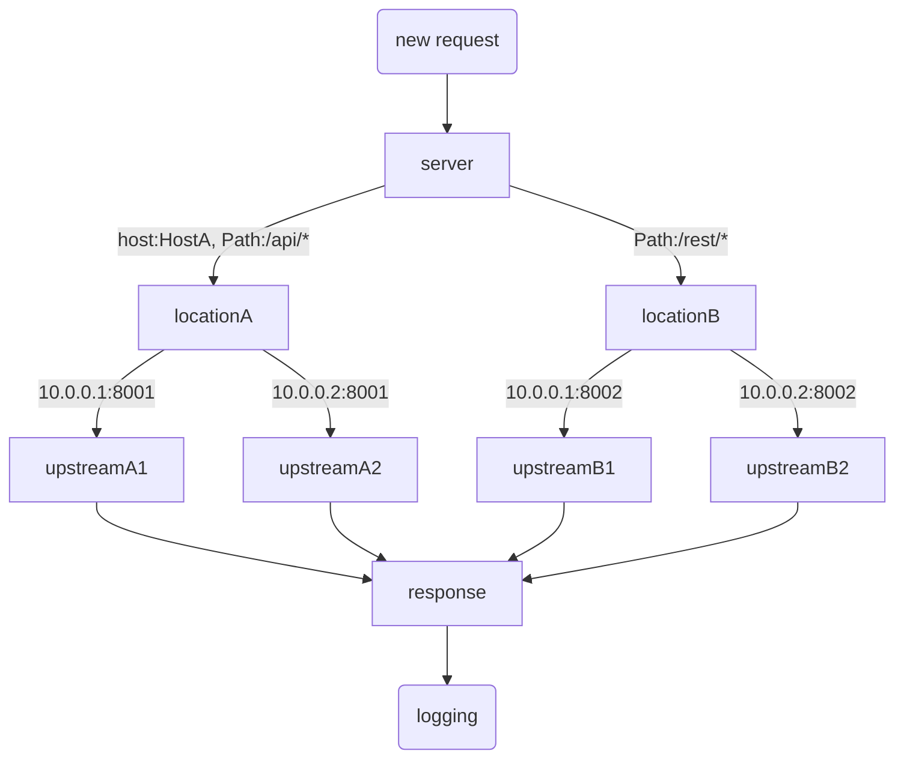

# pingap

## What is Pingap

A reverse proxy like nginx, built on [pingora](https://github.com/cloudflare/pingora), simple and efficient.

## Feature

- Filter location by host and path
- static file serve
- HTTP 1/2 end to end proxy
- Graceful reload
- Template for http access log
- TOML base configuration

## Start

Loads all configurations from `/opt/proxy` and run in the background. Log appends to `/opt/proxy/pingap.log`.

```bash
RUST_LOG=INFO pingap -c=/opt/proxy/pingap.toml -d --log=/opt/proxy/pingap.log
```

## Graceful restart

Validate the configurations, send quit signal to pingap, then start a new process to handle all requests.

```bash
RUST_LOG=INFO pingap -c=/opt/proxy/pingap.toml -t \
  && pkill -SIGQUIT pingap \
  && RUST_LOG=INFO pingap -c=/opt/proxy/pingap.toml -d -u --log=/opt/proxy/pingap.log
```

## Config

All toml configurations are as follows [pingap.toml](./conf/pingap.toml).

## Proxy step



## Rust version

Our current MSRV is 1.74

# License

This project is Licensed under [Apache License, Version 2.0](./LICENSE).
