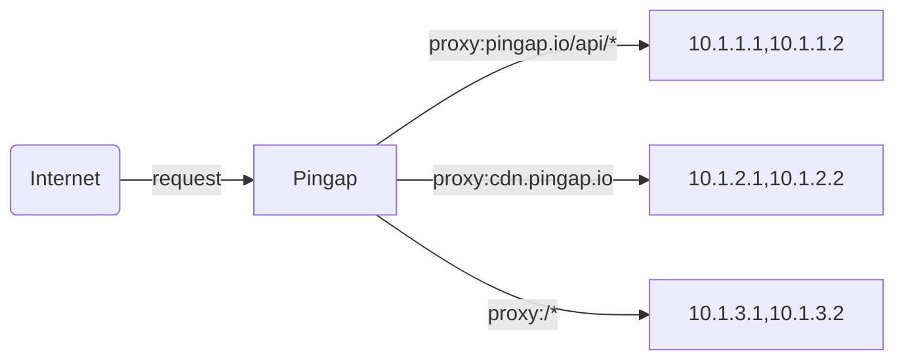
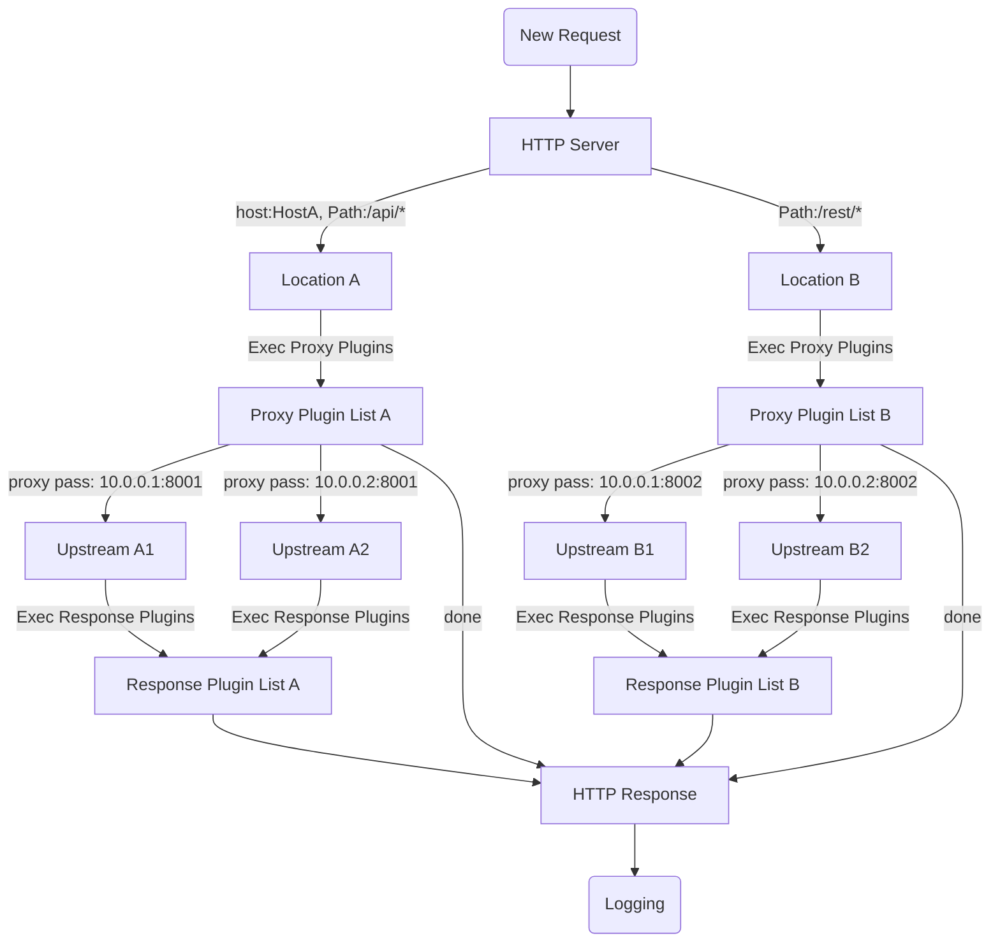

# pingap

Before the pingap version is stable, no pull requests will be accepted. If you have any questions, please create a new issue first.


## Overview

Pingap is a high-performance reverse proxy powered by the [`Cloudflare Pingora`](https://github.com/cloudflare/pingora) . It simplifies operational management by enabling dynamic, zero-downtime configuration hot-reloading through concise TOML files and an intuitive web admin interface.

Its core strength lies in a powerful plugin system, offering over twenty out-of-the-box features for Authentication (JWT, Key Auth), Security (CSRF, IP/Referer/UA Restrictions), Traffic Control (Rate Limiting, Caching), Content Modification (Redirects, Content Substitution), and Observability (Request ID). This makes `Pingap` not just a proxy, but a flexible and extensible application gateway, engineered to effortlessly handle complex scenarios from API protection to modern web application deployments.


[中文说明](./README_zh.md) | [Examples](./examples/README.md) | [Documentation](http://pingap.io/pingap-en/)



## Key Features

- 🚀 High Performance & Reliability
  - Built with Rust for memory safety and top-tier performance.
  - Powered by Cloudflare Pingora, a battle-tested asynchronous networking library.
  - Supports HTTP/1.1, HTTP/2, and gRPC-web proxying.

- 🔧 Dynamic & Easy to Use
  - Zero-downtime configuration changes with hot-reloading.
  - Simple, human-readable TOML configuration files.
  - Full-featured Web UI for intuitive, real-time management.
  - Supports both file and etcd as configuration backends.
  - Supports configuration history record, can restore to the history version with one click.

- 🧩 Powerful Extensibility
  - A rich plugin system to handle common gateway tasks.
  - Advanced routing with host, path, and regex matching.
  - Built-in service discovery via static lists, DNS, or Docker labels.
  - Automated HTTPS with Let's Encrypt (supporting both HTTP-01 and DNS-01 challenges).

- 📊 Modern Observability
  - Native Prometheus metrics for monitoring (pull & push modes).
  - Integrated OpenTelemetry support for distributed tracing.
  - Highly customizable access logs with over 30 variables.
  - Detailed performance metrics, including upstream connect time, processing time, and more.

## 🚀 Getting Started

The easiest way to get started with Pingap is by using Docker Compose.

1. Create a `docker-compose.yml` file:

```yaml
# docker-compose.yml
version: '3.8'

services:
  pingap:
    image: vicanso/pingap:latest # For production, use a specific version like vicanso/pingap:0.12.1-full
    container_name: pingap-instance
    restart: always
    ports:
      - "80:80"
      - "443:443"
    volumes:
      # Mount a local directory to persist all configurations and data
      - ./pingap_data:/opt/pingap
    environment:
      # Configure using environment variables
      - PINGAP_CONF=/opt/pingap/conf
      - PINGAP_ADMIN_ADDR=0.0.0.0:80/pingap
      - PINGAP_ADMIN_USER=pingap
      - PINGAP_ADMIN_PASSWORD=<YourSecurePassword> # Change this!
    command:
      # Start pingap and enable hot-reloading
      - pingap
      - --autoreload
```

2. Create a data directory and run:

```bash
mkdir pingap_data
docker-compose up -d
```

3. Access the Admin UI:

Your Pingap instance is now running! You can access the web admin interface at http://localhost/pingap with the credentials you set.

For more detailed instructions, including running from a binary, check out our [Documentation](https://pingap.io/pingap-en/docs/getting_started).


## Dynamic Configuration

Pingap is designed to adapt to configuration changes without downtime.

Hot Reload (--autoreload): For most changes—like updating upstreams, locations, or plugins—Pingap applies the new configuration within 10 seconds without a restart. This is the recommended mode for containerized environments.

Graceful Restart (-a or --autorestart): For fundamental changes (like modifying server listen ports), this mode performs a full, zero-downtime restart, ensuring no requests are dropped.


## 🔧 Development

```bash
make dev
```

If you need a web admin, you should install nodejs and build web asssets.

```bash
# generate admin web asset
cd web
npm i 
cd ..
make build-web
```


## 📝 Configuration

```toml
[upstreams.charts]
addrs = ["127.0.0.1:5000"]

[locations.lo]
upstream = "charts"
path = "/"

[servers.test]
addr = "0.0.0.0:6188"
locations = ["lo"]
```

You can find the relevant instructions here: [https://pingap.io/pingap-en/docs/config](https://pingap.io/pingap-en/docs/config).

## 🔄 Proxy step



## 📊 Performance

CPU: M4 Pro, Thread: 1

### Ping no access log

```bash
wrk 'http://127.0.0.1:6118/ping' --latency

Running 10s test @ http://127.0.0.1:6118/ping
  2 threads and 10 connections
  Thread Stats   Avg      Stdev     Max   +/- Stdev
    Latency    66.41us   23.67us   1.11ms   76.54%
    Req/Sec    73.99k     2.88k   79.77k    68.81%
  Latency Distribution
     50%   67.00us
     75%   80.00us
     90%   91.00us
     99%  116.00us
  1487330 requests in 10.10s, 194.32MB read
Requests/sec: 147260.15
Transfer/sec:     19.24MB
```

<div align="center">
  
</div>

## 📦 Rust version

Our current MSRV is 1.83

## 📄 License

This project is Licensed under [Apache License, Version 2.0](./LICENSE).
