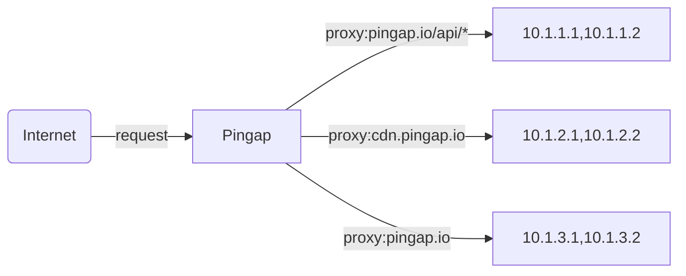
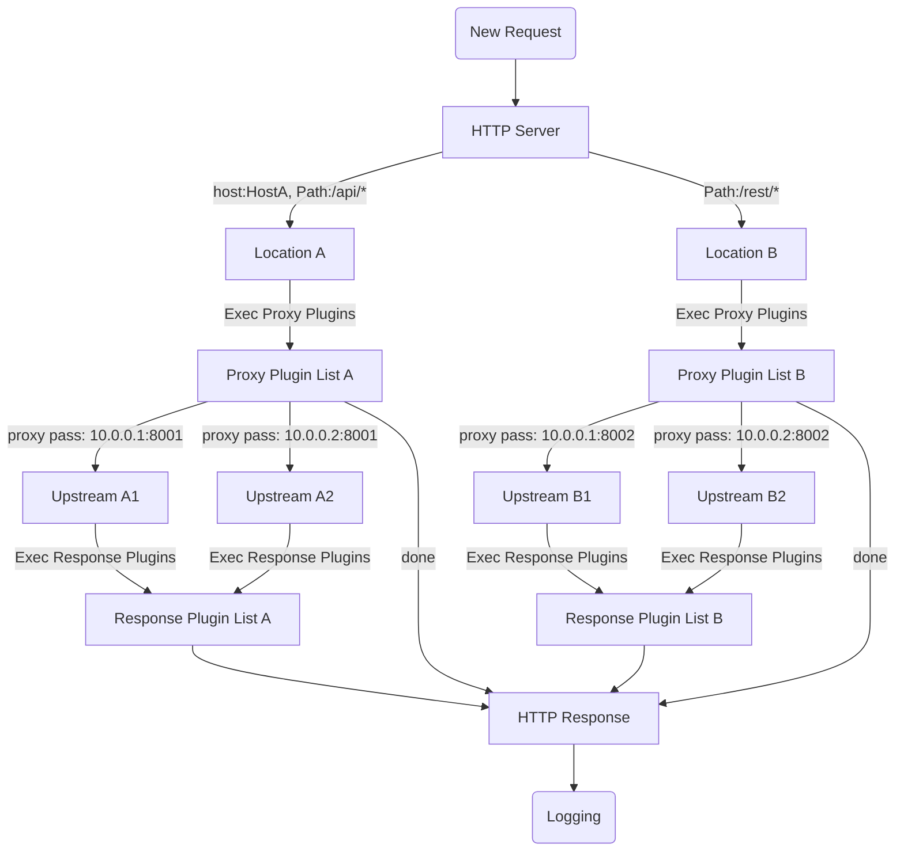

# pingap


## What is Pingap

A reverse proxy like nginx, built on [pingora](https://github.com/cloudflare/pingora), simple and efficient.

[中文说明](./README_zh.md)



## Feature

- Server supports multiple locations, select the location by host and path
- Using regular expression rewriting path
- HTTP 1/2 end to end proxy, including h2c
- TOML base configuration, file or etcd storage
- Uptream and location changes are effective immediately, and other configurations are effective after graceful restart
- Template for http access log, supports more than 30 attributes
- Admin Web UI configuration which is easy to use
- Genrate TLS certificates from let's encrypt
- Server supports multiple tls certificates for different domains
- Notification events: `lets_encrypt`, `backend_status`, `diff_config`, `restart`, etc.
- Http proxy plugins: `compression`, `static serve`, `limit`, `stats`, `mock`, etc.
- Statistics at different stages: `upstream_connect_time`, `upstream_processing_time`, `compression_time`, `cache_lookup_time` and `cache_lock_time`

## Start

Loads all configurations from `/opt/pingap/conf` and run in the background. Log appends to `/opt/pingap/pingap.log`.

```bash
RUST_LOG=INFO pingap -c=/opt/pingap/conf -d --log=/opt/pingap/pingap.log
```

## Graceful restart

Validate the configurations, send quit signal to pingap, then start a new process to handle all requests.

```bash
RUST_LOG=INFO pingap -c=/opt/pingap/conf -t \
  && pkill -SIGQUIT pingap \
  && RUST_LOG=INFO pingap -c=/opt/pingap/conf -d -u --log=/opt/pingap/pingap.log
```

## Auto restart

Watch the configurations, if one of them changes, graceful restart pingap. `autoreload` means if only the upstream and location configurations are updated, they will take effect immediately without restarting.

```bash
RUST_LOG=INFO pingap -c=/opt/pingap/conf \
  && -a -d --autoreload --log=/opt/pingap/pingap.log
```

## Docker

`cGluZ2FwOjEyMzEyMw==` is base64("pingap:123123")

```bash
docker run -it -d --restart=always \
  -v $PWD/pingap:/opt/pingap \
  -p 3018:3018 \
  vicanso/pingap -c /opt/pingap/conf \
  --autoreload \
  --admin=cGluZ2FwOjEyMzEyMw==@0.0.0.0:3018
```

## Dev

```bash
make dev
```

If you need a web admin, you should install nodejs and build web asssets.

```bash
# generate admin web asset
cd web
yarn install
cd ..
make build-web
```


## Config

All toml configurations are as follows [pingap.toml](./conf/pingap.toml).

## Proxy step



## Performance

CPU: M2, Thread: 1

### Ping no accces log:

```bash
wrk 'http://127.0.0.1:6188/ping' --latency

Running 10s test @ http://127.0.0.1:6188/ping
  2 threads and 10 connections
  Thread Stats   Avg      Stdev     Max   +/- Stdev
    Latency    67.10us   67.52us   4.63ms   99.53%
    Req/Sec    74.82k     2.57k   85.56k    92.57%
  Latency Distribution
     50%   69.00us
     75%   76.00us
     90%   83.00us
     99%  105.00us
  1504165 requests in 10.10s, 196.52MB read
Requests/sec: 148928.76
Transfer/sec:     19.46MB
```

[More Performance](./docs/performance.md)

## Rust version

Our current MSRV is 1.74

# License

This project is Licensed under [Apache License, Version 2.0](./LICENSE).
