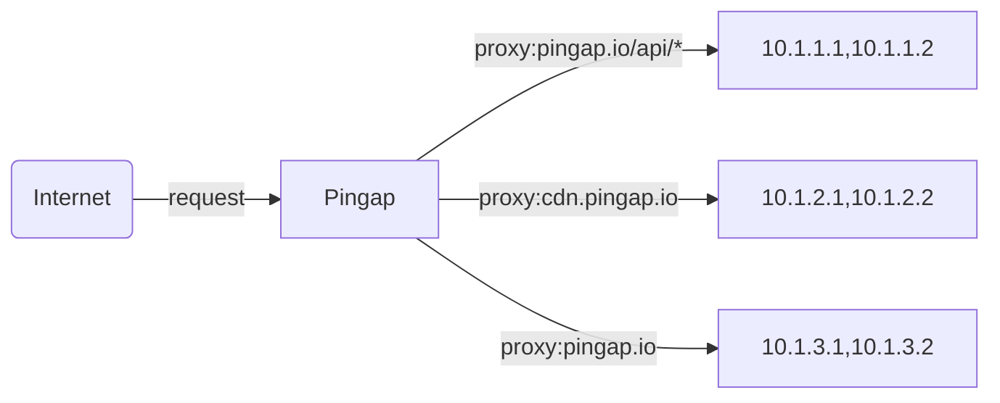
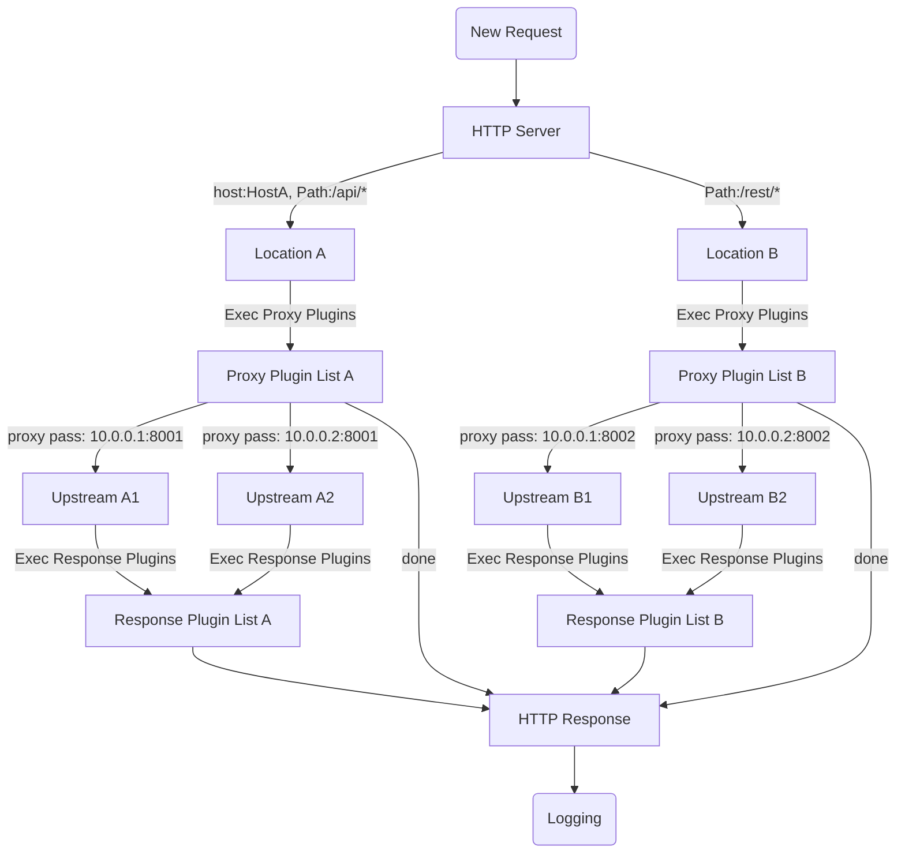

# pingap


## Overview

Pingap is a high-performance reverse proxy built on [pingora](https://github.com/cloudflare/pingora), offering a simpler and more efficient alternative to nginx. It includes optional Sentry and OpenTelemetry support in its full-featured version.

[中文说明](./README_zh.md) | [Examples](./examples/README.md) | [Documentation](http://pingap.io/pingap-en/)



## Key Features

- **Multi-Location Support**: Configure multiple locations with host/path filtering and weighted routing
- **Advanced Proxy Features**:
  - Path rewriting with regex support
  - Transparent proxy
  - HTTP/1.1 and HTTP/2 support (including h2c)
  - gRPC-web reverse proxy
- **Service Discovery**: Static, DNS, and Docker label support
- **Monitoring & Observability**:
  - 10+ Prometheus metrics (pull/push)
  - OpenTelemetry with W3C context and Jaeger trace support
  - Detailed access logging with 30+ configurable attributes
- **Configuration**:
  - TOML-based configuration
  - File and etcd storage support
  - Hot reload support (10-second activation)
  - Web UI for easy management
- **Security & Performance**:
  - Let's Encrypt integration
  - Multi-domain TLS support with automatic certificate selection
  - HTTP plugin system (caching, compression, auth, rate limiting)
  - Detailed performance metrics

## Start

Loads all configurations from `/opt/pingap/conf` or file `/opt/pingap/pingap.toml` and run in the background. Log appends to `/opt/pingap/pingap.log`.

```bash
RUST_LOG=INFO pingap -c=/opt/pingap/conf -d --log=/opt/pingap/pingap.log
```

## Graceful restart

Validate the configurations, send quit signal to pingap, then start a new process to handle all requests.

```bash
RUST_LOG=INFO pingap -c=/opt/pingap/conf -t \
  && pkill -SIGQUIT pingap \
  && RUST_LOG=INFO pingap -c=/opt/pingap/conf -d -u --log=/opt/pingap/pingap.log
```

## Auto restart

Watch the configurations, if one of them changes, graceful restart pingap. `autoreload` means if only the upstream and location configurations are updated, they will take effect about 10s without restarting.

```bash
RUST_LOG=INFO pingap -c=/opt/pingap/conf \
  -a -d --autoreload --log=/opt/pingap/pingap.log
```

## Docker

```bash
docker run -it -d --restart=always \
  -v $PWD/pingap:/opt/pingap \
  -p 3018:3018 \
  vicanso/pingap -c /opt/pingap/conf \
  --autoreload \
  --admin=pingap:123123@0.0.0.0:3018
```

## Dev

```bash
make dev
```

If you need a web admin, you should install nodejs and build web asssets.

```bash
# generate admin web asset
cd web
yarn install
cd ..
make build-web
```


## Config

```toml
[upstreams.charts]
addrs = ["127.0.0.1:5000"]

[locations.lo]
upstream = "charts"
path = "/"

[servers.test]
addr = "0.0.0.0:6188"
locations = ["lo"]
```

All toml configurations are as follows [pingap.toml](./conf/pingap.toml).

## Proxy step



## Performance

CPU: M4 Pro, Thread: 1

### Ping no access log:

```bash
wrk 'http://127.0.0.1:6100/ping' --latency

Running 10s test @ http://127.0.0.1:6100/ping
  2 threads and 10 connections
  Thread Stats   Avg      Stdev     Max   +/- Stdev
    Latency    59.87us   20.27us   1.00ms   81.00%
    Req/Sec    82.12k     3.04k   85.77k    90.59%
  Latency Distribution
     50%   63.00us
     75%   69.00us
     90%   76.00us
     99%   97.00us
  1650275 requests in 10.10s, 215.61MB read
Requests/sec: 163396.17
Transfer/sec:     21.35MB
```

## Rust version

Our current MSRV is 1.74

# License

This project is Licensed under [Apache License, Version 2.0](./LICENSE).
