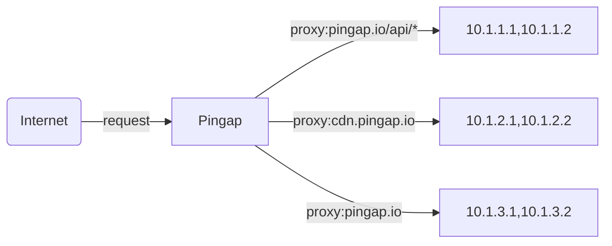
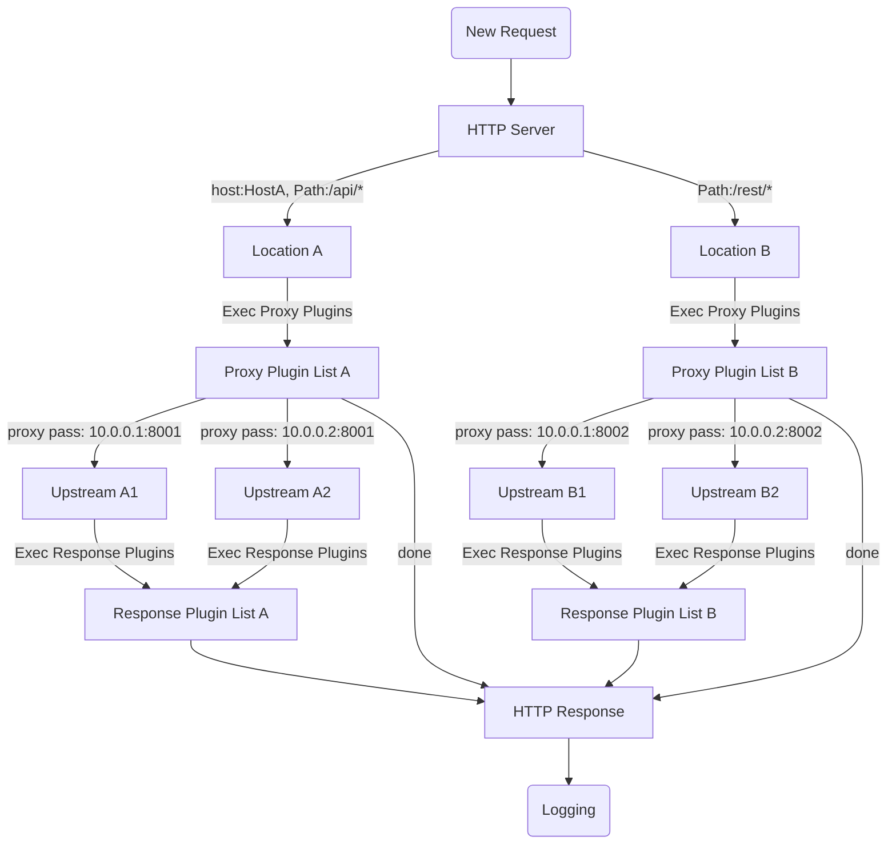

# pingap

Before the pingap version is stable, no pull requests will be accepted. If you have any questions, please create a new issue first.


## Overview

Pingap is a high-performance reverse proxy built on [pingora](https://github.com/cloudflare/pingora), offering a simpler and more efficient alternative to nginx. Sentry and OpenTelemetry are supported in full-featured release version.

[中文说明](./README_zh.md) | [Examples](./examples/README.md) | [Documentation](http://pingap.io/pingap-en/)



## Key Features

- **Multi-Location Support**: Configure multiple locations with host/path filtering and weighted routing
- **Advanced Proxy Features**:
  - Path rewriting with regex support
  - Transparent proxy
  - HTTP/1.1 and HTTP/2 support (including h2c)
  - gRPC-web reverse proxy
- **Service Discovery**: Static, DNS, and Docker label support
- **Monitoring & Observability**:
  - 10+ Prometheus metrics (pull/push)
  - OpenTelemetry with W3C context and Jaeger trace support
  - Access logging with 30+ configurable attributes
- **Configuration**:
  - TOML-based configuration
  - File and etcd storage support
  - Hot reload support (10-second activation)
  - Web UI for easy management
- **Security & Performance**:
  - Let's Encrypt integration
  - Multi-domain TLS support with automatic certificate selection
  - HTTP plugin system (caching, compression, auth, rate limiting)
  - Detailed performance metrics

## Quick Start

Pingap can be started with either a configuration directory or a single TOML file:

```bash
# Using a config directory
RUST_LOG=INFO pingap -c=/opt/pingap/conf -d --log=/opt/pingap/pingap.log

# Using a single TOML file
RUST_LOG=INFO pingap -c=/opt/pingap/pingap.toml -d --log=/opt/pingap/pingap.log
```

Key flags:
- `-c`: Path to config directory or TOML file
- `-d`: Run in daemon/background mode
- `--log`: Path to log file (logs are appended)
- `RUST_LOG=INFO`: Set logging level (DEBUG, INFO, WARN, ERROR)

## Graceful Restart

Performs a zero-downtime restart of Pingap by following these steps:
1. Validates the new configuration
2. Gracefully shuts down the existing process
3. Starts a new process to handle incoming requests

```bash
# Graceful restart command
RUST_LOG=INFO pingap -c=/opt/pingap/conf -t \
  && pkill -SIGQUIT pingap \
  && RUST_LOG=INFO pingap -c=/opt/pingap/conf -d -u --log=/opt/pingap/pingap.log
```

Key flags:
- `-t`: Test/validate configuration before restart
- `-u`: Upgrade mode (ensures smooth handover from old process)
- `-d`: Run in daemon mode
- `SIGQUIT`: Signal for graceful shutdown

## Auto Restart

Automatically monitors configuration files and handles changes in two ways:
- **Full Restart**: When core configurations change, performs a graceful restart
- **Hot Reload**: When only upstream or location configurations change, updates take effect within ~10 seconds without restart

```bash
# Enable auto-restart and hot reload
RUST_LOG=INFO pingap -c=/opt/pingap/conf \
  -a -d --autoreload --log=/opt/pingap/pingap.log
```

Key flags:
- `-a`: Enable auto-restart on configuration changes
- `--autoreload`: Enable hot reload for upstream/location changes
- `-d`: Run in daemon mode
- `-c`: Path to configuration directory

## Docker

Run Pingap in a Docker container with auto-reload and admin interface enabled:

```bash
docker run -d --restart=always \
  -v $PWD/pingap:/opt/pingap \
  -p 3018:3018 \
  -e PINGAP_ADMIN_ADDR=0.0.0.0:3018 \
  -e PINGAP_ADMIN_USER=pingap \
  -e PINGAP_ADMIN_PASSWORD=123123 \
  -e PINGAP_AUTORELOAD=true \
  vicanso/pingap -c /opt/pingap/conf
```

Key options:
- `-d`: Run container in detached/background mode
- `--restart=always`: Automatically restart container if it stops
- `-v $PWD/pingap:/opt/pingap`: Mount local config directory into container
- `-p 3018:3018`: Expose admin interface port

Note: Remember to change the default admin credentials (`pingap:123123`) in production environments.

## Dev

```bash
make dev
```

If you need a web admin, you should install nodejs and build web asssets.

```bash
# generate admin web asset
cd web
npm i 
cd ..
make build-web
```


## Config

```toml
[upstreams.charts]
addrs = ["127.0.0.1:5000"]

[locations.lo]
upstream = "charts"
path = "/"

[servers.test]
addr = "0.0.0.0:6188"
locations = ["lo"]
```

All toml configurations are as follows [pingap.toml](./conf/pingap.toml).

## Proxy step



## Performance

CPU: M4 Pro, Thread: 1

### Ping no access log:

```bash
wrk 'http://127.0.0.1:6118/ping' --latency

Running 10s test @ http://127.0.0.1:6118/ping
  2 threads and 10 connections
  Thread Stats   Avg      Stdev     Max   +/- Stdev
    Latency    66.41us   23.67us   1.11ms   76.54%
    Req/Sec    73.99k     2.88k   79.77k    68.81%
  Latency Distribution
     50%   67.00us
     75%   80.00us
     90%   91.00us
     99%  116.00us
  1487330 requests in 10.10s, 194.32MB read
Requests/sec: 147260.15
Transfer/sec:     19.24MB
```

## Rust version

Our current MSRV is 1.83

# License

This project is Licensed under [Apache License, Version 2.0](./LICENSE).
