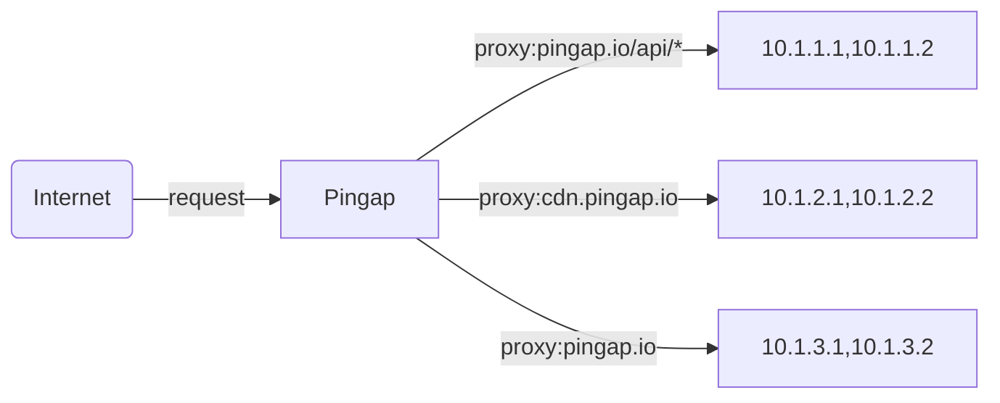
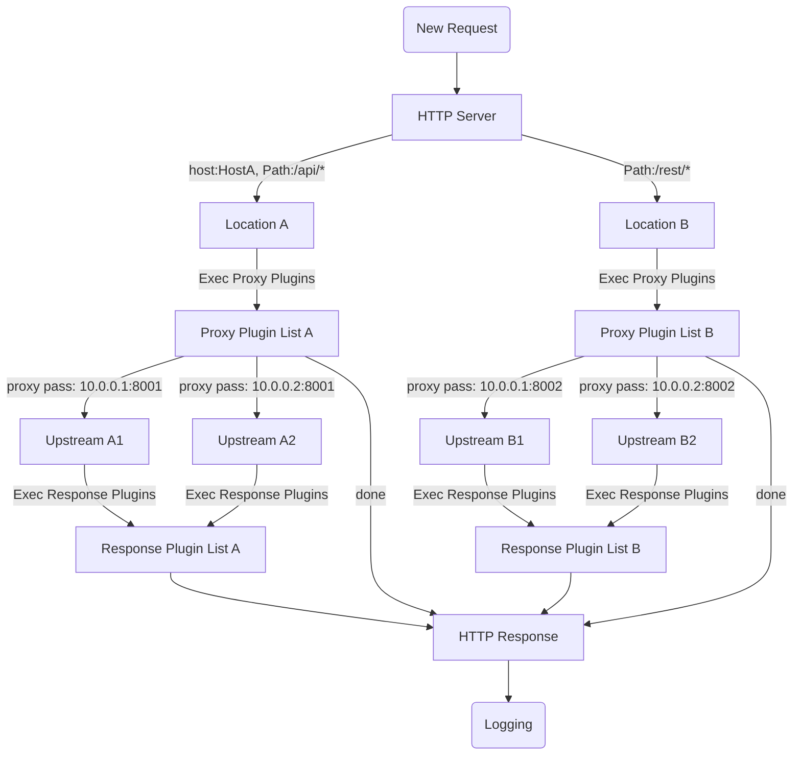

# pingap


## What is Pingap

A reverse proxy like nginx, built on [pingora](https://github.com/cloudflare/pingora), simple and efficient.

Sentry and opentelemetry are optional, they are supported in the full-featured version.

[中文说明](./README_zh.md)



## Feature

- The service supports configuring multiple Locations, filtering locations by host and path, and matching and selecting them one by one according to the weight
- Supports regular form configuration to rewrite Path
- Support HTTP 1/2, including h2c
- Support static, dns and docker label service discovery
- Configuration based on TOML format, the configuration method is very simple, and can be saved to files or etcd
- Supports more than 10 Prometheus indicators, pull and push mode
- Opentelemetry supports w3c context trace and jaeger trace
- Frequently updated Upstream and Location related configuration adjustments take effect in 30 seconds, and after other application configurations are updated, the program is restarted gracefully without interruption
- Templated configuration of access logs, which supports more than 30 related attribute configurations, and various parameters and indicators can be specified as needed
- Web UI for config, simple and easy to use
- Support let's encrypt, just set the domain of http server
- TLS certificates of different domain names can be served in the same service port, and the matching certificate is automatically selected according to servername
- Supports push of various events: lets_encrypt, backend_status, diff_config, restart, etc.
- Many http plugins, such as cache service components, compression components with multiple compression algorithms, authentication components, limiting components, etc.
- Provides statistical data at different stages, such as upstream_connect_time, upstream_processing_time, compression_time, cache_lookup_time and cache_lock_time, etc.

## Start

Loads all configurations from `/opt/pingap/conf` or file `/opt/pingap/pingap.toml` and run in the background. Log appends to `/opt/pingap/pingap.log`.

```bash
RUST_LOG=INFO pingap -c=/opt/pingap/conf -d --log=/opt/pingap/pingap.log
```

## Graceful restart

Validate the configurations, send quit signal to pingap, then start a new process to handle all requests.

```bash
RUST_LOG=INFO pingap -c=/opt/pingap/conf -t \
  && pkill -SIGQUIT pingap \
  && RUST_LOG=INFO pingap -c=/opt/pingap/conf -d -u --log=/opt/pingap/pingap.log
```

## Auto restart

Watch the configurations, if one of them changes, graceful restart pingap. `autoreload` means if only the upstream and location configurations are updated, they will take effect about 10s without restarting.

```bash
RUST_LOG=INFO pingap -c=/opt/pingap/conf \
  -a -d --autoreload --log=/opt/pingap/pingap.log
```

## Docker

`cGluZ2FwOjEyMzEyMw==` is base64("pingap:123123")

```bash
docker run -it -d --restart=always \
  -v $PWD/pingap:/opt/pingap \
  -p 3018:3018 \
  vicanso/pingap -c /opt/pingap/conf \
  --autoreload \
  --admin=cGluZ2FwOjEyMzEyMw==@0.0.0.0:3018
```

## Dev

```bash
make dev
```

If you need a web admin, you should install nodejs and build web asssets.

```bash
# generate admin web asset
cd web
yarn install
cd ..
make build-web
```


## Config

```toml
[upstreams.charts]
addrs = ["127.0.0.1:5000"]

[locations.lo]
upstream = "charts"
path = "/"

[servers.test]
addr = "0.0.0.0:6188"
locations = ["lo"]
```

All toml configurations are as follows [pingap.toml](./conf/pingap.toml).

## Proxy step



## Performance

CPU: M2, Thread: 1

### Ping no accces log:

```bash
wrk 'http://127.0.0.1:6188/ping' --latency

Running 10s test @ http://127.0.0.1:6188/ping
  2 threads and 10 connections
  Thread Stats   Avg      Stdev     Max   +/- Stdev
    Latency    67.10us   67.52us   4.63ms   99.53%
    Req/Sec    74.82k     2.57k   85.56k    92.57%
  Latency Distribution
     50%   69.00us
     75%   76.00us
     90%   83.00us
     99%  105.00us
  1504165 requests in 10.10s, 196.52MB read
Requests/sec: 148928.76
Transfer/sec:     19.46MB
```

## Rust version

Our current MSRV is 1.74

# License

This project is Licensed under [Apache License, Version 2.0](./LICENSE).
