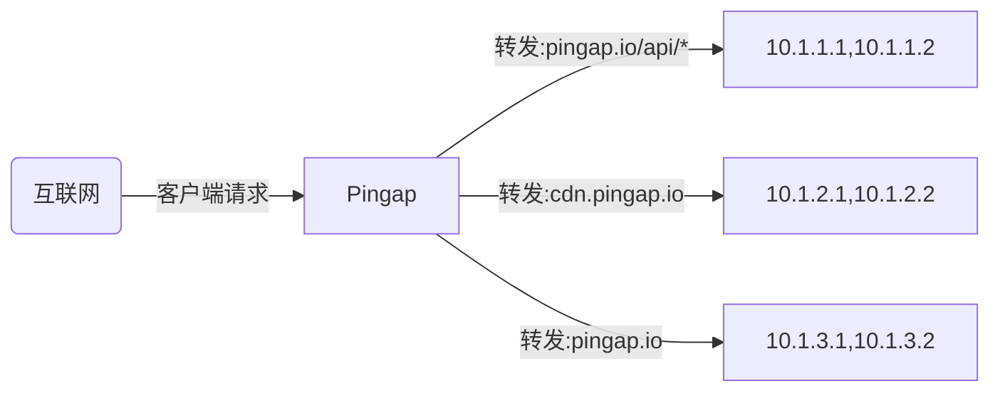
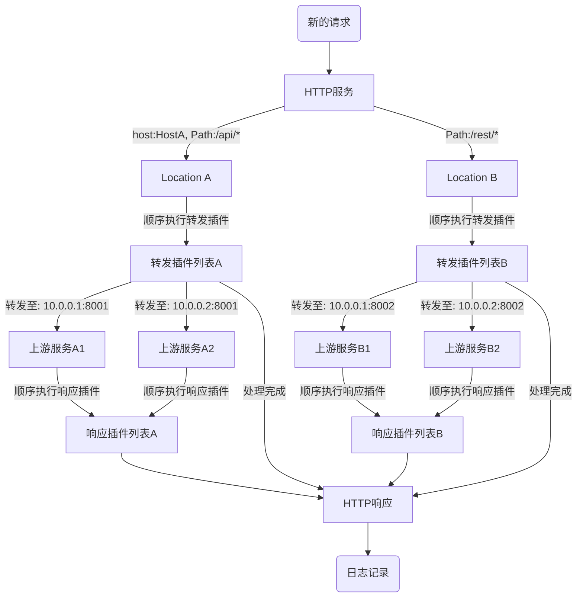

# pingap

Pingap是类似于nginx的反向代理，基于[pingora](https://github.com/cloudflare/pingora)构建，简单而高效。



## 特性

- 服务支持配置多个Location，通过host与path筛选对应的location，按权重逐一匹配选择
- 支持正则形式配置重写Path，方便应用按前缀区分转发
- HTTP 1/2 的全链路支持，包括h2c的支持
- 基于TOML格式的配置，配置方式非常简洁，可保存至文件或etcd
- 支持10多个Prometheus指标，可以使用pull与push的形式收集相关指标
- Opentelemetry支持w3c context trace与jaeger trace的形式
- 频繁更新的Upstream与Location相关配置调整准实时生效(30秒)，其它应用配置更新后，无中断式的优雅重启程序
- 访问日志的模板化配置，已支30多个相关属性的配置，可按需指定输出各种参数与指标
- WEB形式的管理后台界面，无需学习，简单易用
- 开箱即用的let's encrypttls证书，仅需配置对应域名即可
- 不同域名的tls证书可使用在同一服务端口中，按servername自动选择匹配证书
- 支持各种事件的推送：lets_encrypt, backend_status, diff_config, restart等等
- 丰富的http插件，如高效的缓存服务组件、多种压缩算法的压缩组件、不同种类的认证组件、不同形式的限流组件等等
- 提供了不同阶段的统计数据，如upstream_connect_time, upstream_processing_time, compression_time, cache_lookup_time 与 cache_lock_time等

## 启用程序

从 `/opt/pingap/conf`目录中加载所有配置，并以后台程序的形式运行，日志写入至`/opt/pingap/pingap.log`。

```bash
RUST_LOG=INFO pingap -c=/opt/pingap/conf -d --log=/opt/pingap/pingap.log
```

## 优雅重启

校验配置是否正确后，发送信号给pingap并启动新的程序接收原有的请求。

```bash
RUST_LOG=INFO pingap -c=/opt/pingap/conf -t \
  && pkill -SIGQUIT pingap \
  && RUST_LOG=INFO pingap -c=/opt/pingap/conf -d -u --log=/opt/pingap/pingap.log
```

## 自动重启

应用启动后，监听相关配置变化，若有变化则无中断式重启程序或热更新加载配置。`autoreload`参数表示如果只是upstream与location的配置变化，则准实时(30秒内)刷新对应配置生效，无需重启。

```bash
RUST_LOG=INFO pingap -c=/opt/pingap/conf \
  && -a -d --autoreload --log=/opt/pingap/pingap.log
```

## 应用配置

```toml
[upstreams.charts]
addrs = ["127.0.0.1:5000"]

[locations.lo]
upstream = "charts"
path = "/"

[servers.test]
addr = "0.0.0.0:6188"
locations = ["lo"]
```

所有的应用配置可查阅说明： [pingap.toml](./conf/pingap.toml)。

## 请求处理流程



## 性能测试

CPU: M2, Thread: 1

```bash
wrk 'http://127.0.0.1:6188/stats' --latency
Running 10s test @ http://127.0.0.1:6188/stats
  2 threads and 10 connections
  Thread Stats   Avg      Stdev     Max   +/- Stdev
    Latency    87.92us   60.91us   3.69ms   89.97%
    Req/Sec    57.32k     2.17k   69.69k    91.09%
  Latency Distribution
     50%   93.00us
     75%  100.00us
     90%  106.00us
     99%  133.00us
  1151171 requests in 10.10s, 320.61MB read
Requests/sec: 113977.63
Transfer/sec:     31.74MB
```

## 最低支持rust版本

最低支持的rust版本为1.74

# 开源协议

This project is Licensed under [Apache License, Version 2.0](./LICENSE).
