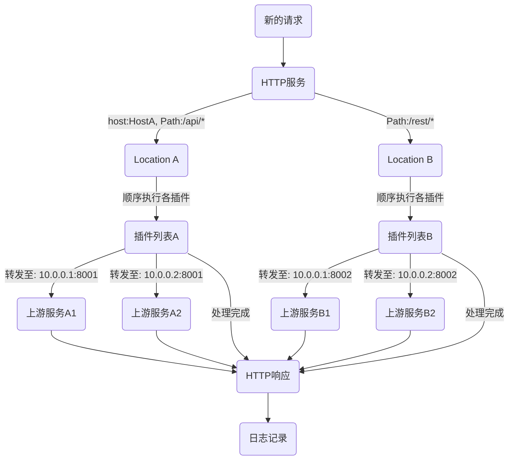

# pingap

Pingap是类似于nginx的反向代理，基于[pingora](https://github.com/cloudflare/pingora)构建，简单而高效。

## 特性

- 支持通过host与path筛选对应的location
- 正则形式重写Path
- HTTP 1/2的全链路支持
- 基于TOML格式的配置，可保存至文件或etcd
- 应用配置更新后，无中断式的优雅更新程序
- 访问日志的模板化配置
- WEB形式的管理后台界面
- 可通过`let's encrypt`生成tls相关证书，简单易用
- 支持各种事件的推送：`lets_encrypt`, `backend_unhealthy`, `diff_config`, `restart`等等
- 丰富的http转发插件：`compression`, `static serve`, `limit`, `stats`, `mock`, 等等

## 使用手册

[使用手册](./SUMMARY.md)

## 启用程序

从 `/opt/proxy`目录中加载所有配置，并以后台程序的形式运行，日志写入至`/opt/proxy/pingap.log`。

```bash
RUST_LOG=INFO pingap -c=/opt/proxy -d --log=/opt/proxy/pingap.log
```

## 优雅重启

校验配置是否正确后，发送信号给pingap并启动新的程序接收原有的请求。

```bash
RUST_LOG=INFO pingap -c=/opt/proxy -t \
  && pkill -SIGQUIT pingap \
  && RUST_LOG=INFO pingap -c=/opt/proxy -d -u --log=/opt/proxy/pingap.log
```

## 应用配置

所有的应用配置可查阅说明： [pingap.toml](./conf/pingap.toml)。

## 请求处理流程



## 性能测试

CPU: M2, Thread: 1

```bash
wrk 'http://127.0.0.1:6188/stats' --latency
Running 10s test @ http://127.0.0.1:6188/stats
  2 threads and 10 connections
  Thread Stats   Avg      Stdev     Max   +/- Stdev
    Latency    87.92us   60.91us   3.69ms   89.97%
    Req/Sec    57.32k     2.17k   69.69k    91.09%
  Latency Distribution
     50%   93.00us
     75%  100.00us
     90%  106.00us
     99%  133.00us
  1151171 requests in 10.10s, 320.61MB read
Requests/sec: 113977.63
Transfer/sec:     31.74MB
```

## 最低支持rust版本

最低支持的rust版本为1.74

# 开源协议

This project is Licensed under [Apache License, Version 2.0](./LICENSE).
