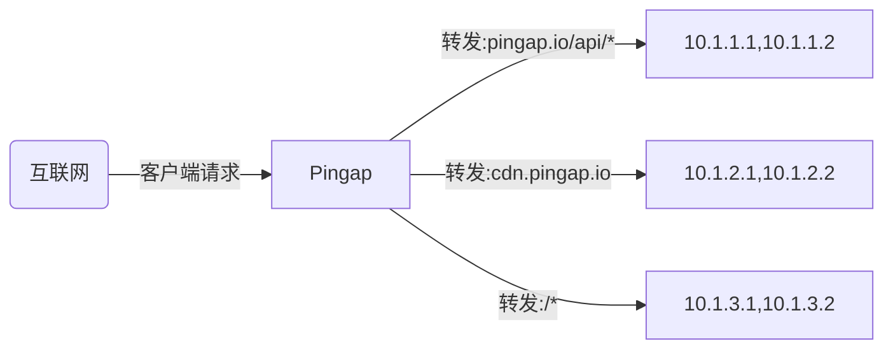
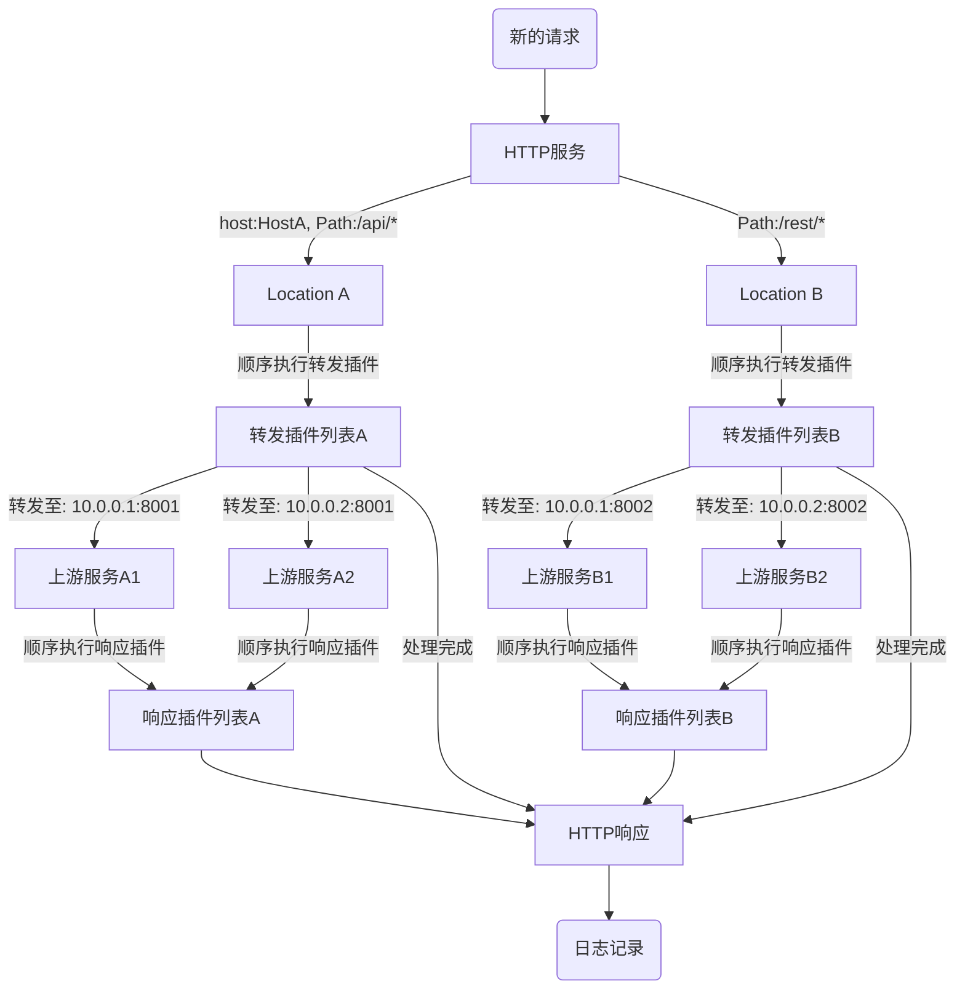

# Pingap

Pingap在发布稳定版本之前，暂时不接受 pull requests，如果有问题可以先提issue，会及时处理。

Pingap 是一款由 [`Cloudflare Pingora`](https://github.com/cloudflare/pingora) 框架驱动的高性能反向代理。它通过简洁的 TOML 文件和直观的 Web 管理界面，实现了动态、零停机的配置热更新，极大地简化了运维管理。

其核心优势在于强大的插件体系，提供了超过一打的开箱即用的功能，涵盖认证 (JWT, Key Auth)、安全 (CSRF, IP/Referer/UA 限制)、流量控制 (限流、缓存)、内容修改 (重定向、内容替换) 和可观测性 (请求 ID)。

这使得 Pingap 不仅仅是一个代理，更是一个灵活且可扩展的应用网关，旨在轻松应对从 API 保护到现代化 Web 应用部署的各类复杂场景。


[使用示例](./examples/README.md) | [详细文档](http://pingap.io/pingap-zh/)




## 核心特性

- 🚀 高性能与高可靠性
  - 基于 `Rust` 构建，确保内存安全与顶尖性能。
  - 由 `Cloudflare Pingora` 驱动，一个经过实战考验的异步网络库。
  - 支持 HTTP/1.1、HTTP/2 和 gRPC-web 代理。

- 🔧 动态化与易用性
  - 通过热更新实现零停机的配置变更。
  - 简单且人类可读的 TOML 配置文件。
  - 功能齐全的 Web UI，提供直观的实时管理。
  - 同时支持文件和 etcd 作为配置后端。
  - 支持配置变更历史记录功能，可一键恢复到历史版本。

- 🧩 强大的可扩展性
  - 丰富的插件体系，用于处理常见的网关任务。
  - 支持基于主机、路径和正则表达式的高级路由。
  - 内置通过静态列表、DNS 或 Docker 标签的服务发现机制。
  - 通过 Let's Encrypt 实现自动化 HTTPS（支持 HTTP-01 和 DNS-01 两种质询方式）。

- 📊 现代化的可观测性
  - 原生的 Prometheus 指标监控（支持 pull 和 push 模式）。
  - 集成 OpenTelemetry，支持分布式追踪。
  - 超过 30 种变量的高度可定制的访问日志。
  - 包含上游连接、处理时间等详细的性能指标。

## 🚀 快速入门

上手 `Pingap` 最简单的方式是使用 `Docker Compose`。

1. 创建一个 `docker-compose.yml` 文件：

```yaml
# docker-compose.yml
version: '3.8'

services:
  pingap:
    image: vicanso/pingap:latest # 生产环境建议使用具体的版本号，如 vicanso/pingap:0.12.1-full
    container_name: pingap-instance
    restart: always
    ports:
      - "80:80"
      - "443:443"
    volumes:
      # 挂载本地目录以持久化所有配置和数据
      - ./pingap_data:/opt/pingap
    environment:
      # 使用环境变量进行配置
      - PINGAP_CONF=/opt/pingap/conf
      - PINGAP_ADMIN_ADDR=0.0.0.0:80/pingap
      - PINGAP_ADMIN_USER=pingap
      - PINGAP_ADMIN_PASSWORD=<YourSecurePassword> # 修改此密码！
    command:
      # 启动 pingap 并启用热更新
      - pingap
      - --autoreload
```

2. 创建一个数据目录并运行：

```bash
mkdir pingap_data
docker-compose up -d
```

3. 访问管理后台：

您的 Pingap 实例现已运行！您可以使用您设置的凭证，通过 http://localhost/pingap 访问 Web 管理界面。


要了解更多详细说明，包括如何通过二进制文件运行，请查阅我们的[文档](https://pingap.io/pingap-zh/docs/getting_started)。


## 动态配置

Pingap 的设计旨在无需停机即可适应配置变更。

热更新 (--autoreload)：对于大多数变更——如更新上游服务、路由或插件——Pingap 会在10秒内应用新配置，无需重启。这是容器化环境的推荐模式。

平滑重启 (-a 或 --autorestart)：对于基础性变更（如修改服务器监听端口），此模式会执行一次完整的、零停机的重启，确保不丢失任何请求。


## 🔧 开发

```bash
make dev
```

如果需要 Web 管理界面，需要安装 nodejs 并构建 Web 资产。


```bash
# 生成 Web 管理界面资产
cd web
npm i 
cd ..
make build-web
```

## 📝 应用配置

```toml
[upstreams.charts]
addrs = ["127.0.0.1:5000"]

[locations.lo]
upstream = "charts"
path = "/"

[servers.test]
addr = "0.0.0.0:6188"
locations = ["lo"]
```

所有的 TOML 配置可以查阅：[https://pingap.io/pingap-zh/docs/config](https://pingap.io/pingap-zh/docs/config)。


## 🔄 请求处理流程



## 📊 性能测试

CPU: M4 Pro, Thread: 1

### Ping (无访问日志)

```bash
wrk 'http://127.0.0.1:6118/ping' --latency

Running 10s test @ http://127.0.0.1:6118/ping
  2 threads and 10 connections
  Thread Stats   Avg      Stdev     Max   +/- Stdev
    Latency    66.41us   23.67us   1.11ms   76.54%
    Req/Sec    73.99k     2.88k   79.77k    68.81%
  Latency Distribution
     50%   67.00us
     75%   80.00us
     90%   91.00us
     99%  116.00us
  1487330 requests in 10.10s, 194.32MB read
Requests/sec: 147260.15
Transfer/sec:     19.24MB
```

## 📦 最低支持rust版本

最低支持的rust版本为1.83

## 📄 开源协议

本项目采用 [Apache License, Version 2.0](./LICENSE) 开源协议。
