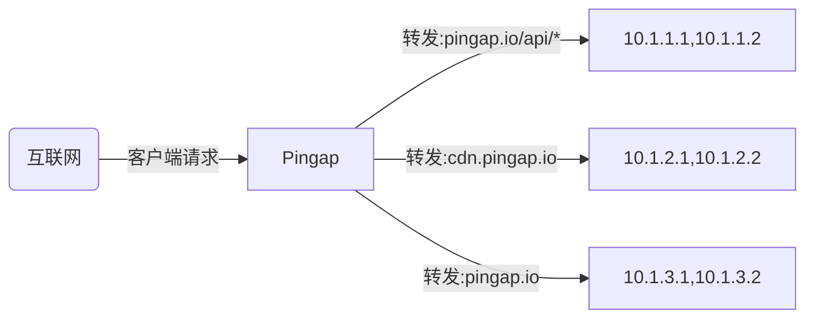
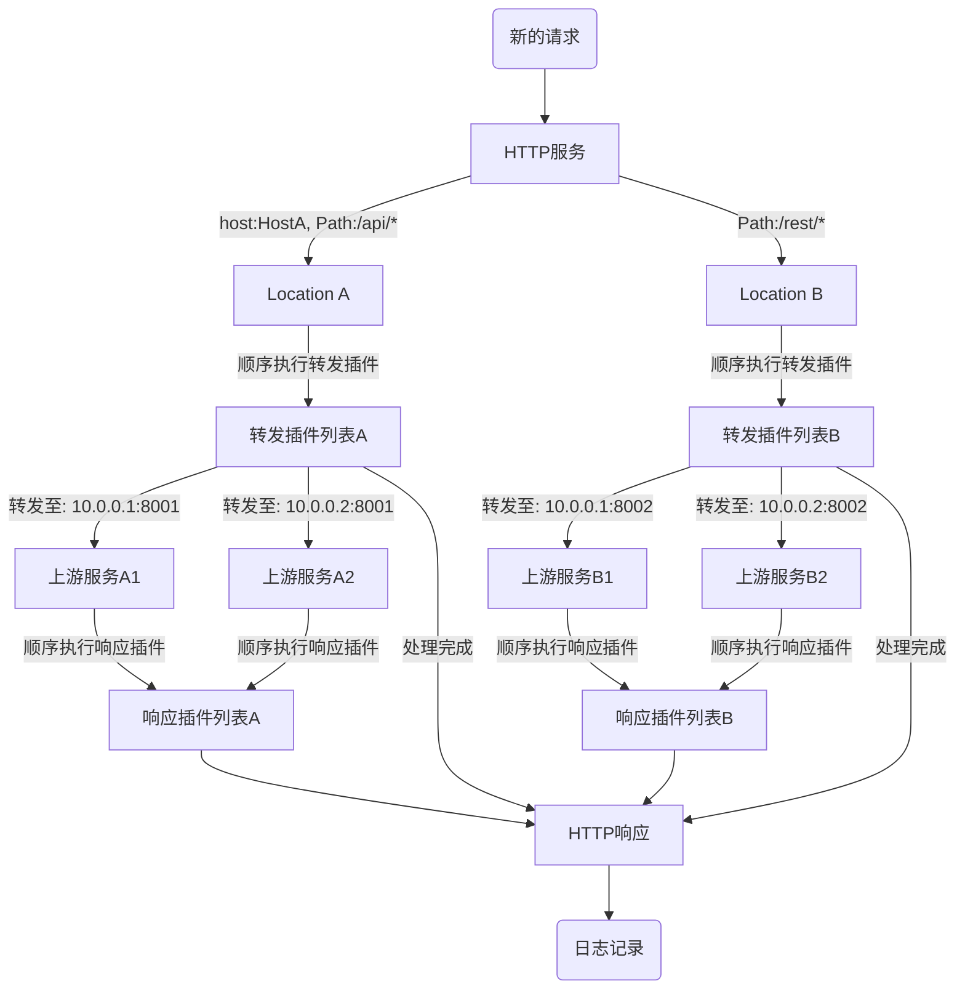

# pingap

Pingap是一个基于[pingora](https://github.com/cloudflare/pingora)构建的高性能反向代理服务器。

可选择性地集成Sentry和OpenTelemetry功能。

[使用示例](./examples/README.md)

[详细文档](./docs/README.md)




## 核心功能

- **支持多Location配置**: 配置多个Location，支持主机/路径过滤和权重路由
- **高级代理功能**:
  - 支持正则表达式的路径重写
  - 透明代理
  - HTTP/1.1 和 HTTP/2 支持（包括 h2c）
  - gRPC-web 反向代理
- **服务发现**: 支持静态、DNS 和 Docker 标签
- **监控与可观测性**:
  - 10+ Prometheus 指标（拉取/推送）
  - OpenTelemetry 支持，包含 W3C 上下文和 Jaeger 追踪
  - 详细的访问日志，含 30+ 可配置属性
- **配置管理**:
  - 基于 TOML 的配置
  - 支持文件和 etcd 存储
  - 热重载支持（10秒内生效）
  - 便捷的 Web 管理界面
- **安全性与性能**:
  - Let's Encrypt 集成
  - 多域名 TLS 支持，自动证书选择
  - HTTP 插件系统（缓存、压缩、认证、限流）
  - 详细的性能指标：包括upstream连接时间、处理时间、压缩时间、缓存查询时间等

## 启用程序

从 `/opt/pingap/conf`目录中加载所有配置，并以后台程序的形式运行，日志写入至`/opt/pingap/pingap.log`。

```bash
RUST_LOG=INFO pingap -c=/opt/pingap/conf -d --log=/opt/pingap/pingap.log
```

## 优雅重启

校验配置是否正确后，发送信号给pingap并启动新的程序接收原有的请求。

```bash
RUST_LOG=INFO pingap -c=/opt/pingap/conf -t \
  && pkill -SIGQUIT pingap \
  && RUST_LOG=INFO pingap -c=/opt/pingap/conf -d -u --log=/opt/pingap/pingap.log
```

## 自动重启

应用启动后，监听相关配置变化，若有变化则无中断式重启程序或热更新加载配置。`autoreload`参数表示如果只是upstream与location的配置变化，则准实时(10秒内)刷新对应配置生效，无需重启。

```bash
RUST_LOG=INFO pingap -c=/opt/pingap/conf \
  -a -d --autoreload --log=/opt/pingap/pingap.log
```

## 应用配置

```toml
[upstreams.charts]
addrs = ["127.0.0.1:5000"]

[locations.lo]
upstream = "charts"
path = "/"

[servers.test]
addr = "0.0.0.0:6188"
locations = ["lo"]
```

所有的应用配置可查阅说明： [pingap.toml](./conf/pingap.toml)。

## 请求处理流程



## 性能测试

CPU: M4 Pro, Thread: 1

```bash
wrk 'http://127.0.0.1:6100/ping' --latency

Running 10s test @ http://127.0.0.1:6100/ping
  2 threads and 10 connections
  Thread Stats   Avg      Stdev     Max   +/- Stdev
    Latency    59.87us   20.27us   1.00ms   81.00%
    Req/Sec    82.12k     3.04k   85.77k    90.59%
  Latency Distribution
     50%   63.00us
     75%   69.00us
     90%   76.00us
     99%   97.00us
  1650275 requests in 10.10s, 215.61MB read
Requests/sec: 163396.17
Transfer/sec:     21.35MB
```

## 最低支持rust版本

最低支持的rust版本为1.74

# 开源协议

This project is Licensed under [Apache License, Version 2.0](./LICENSE).
