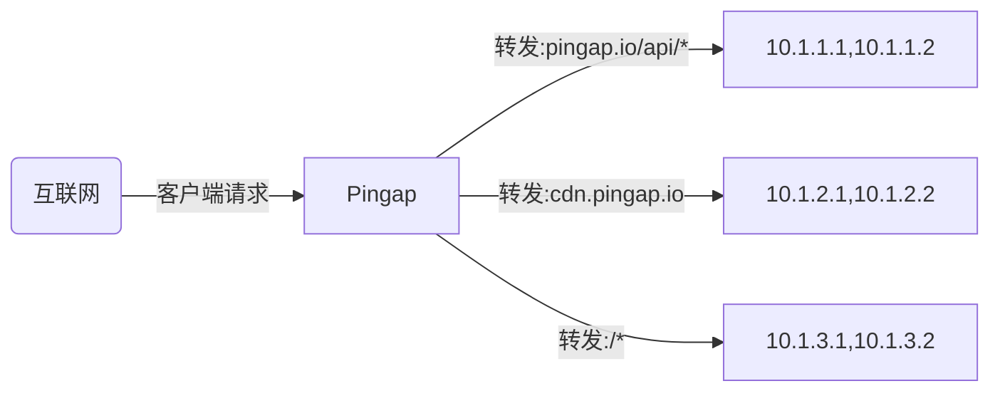
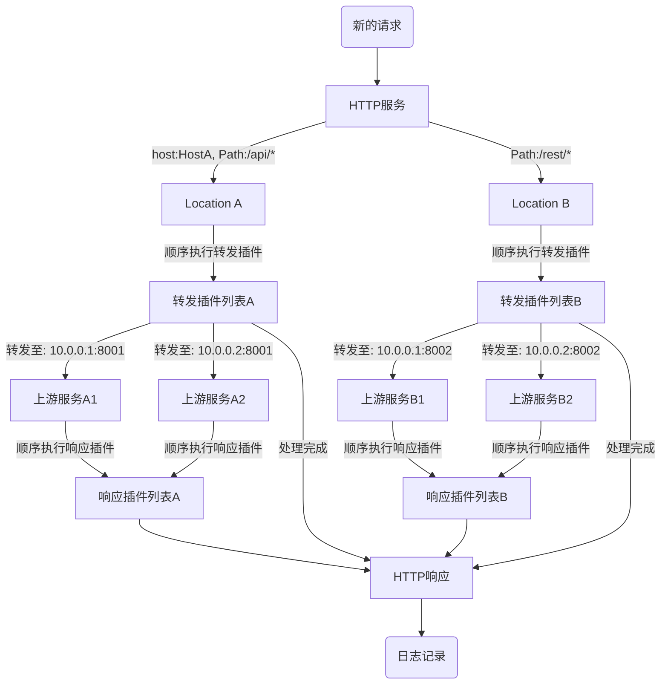

# pingap

Pingap在发布稳定版本之前，暂时不接受 pull requests，如果有问题可以先提issue，会及时处理。

Pingap是一个基于[pingora](https://github.com/cloudflare/pingora)构建的高性能反向代理服务器。

可选择性地集成Sentry和OpenTelemetry功能。

[使用示例](./examples/README.md) | [详细文档](http://pingap.io/pingap-zh/)




## 核心功能

- **支持多Location配置**: 配置多个Location，支持主机/路径过滤和权重路由
- **高级代理功能**:
  - 支持正则表达式的路径重写
  - 透明代理
  - HTTP/1.1 和 HTTP/2 支持（包括 h2c）
  - gRPC-web 反向代理
- **服务发现**: 支持静态配置、DNS 和 Docker 标签
- **监控与可观测性**:
  - 10+ Prometheus 指标（拉取/推送）
  - OpenTelemetry 支持，包含 W3C 上下文和 Jaeger 追踪
  - 详细的访问日志，含 30+ 可配置属性
- **配置管理**:
  - 基于 TOML 的配置
  - 支持文件和 etcd 存储
  - 热重载支持（10秒内生效）
  - 便捷的 Web 管理界面
- **安全性与性能**:
  - 集成 Let's Encrypt (支持 dns-01 或 http-01 challenge)
  - 多域名 TLS 支持，自动证书选择
  - HTTP 插件系统（缓存、压缩、认证、限流）
  - 详细的性能指标：包括upstream连接时间、处理时间、压缩时间、缓存查询时间等

## 启动服务

使用以下命令从指定配置目录启动 Pingap 服务：

```bash
RUST_LOG=INFO pingap -c=/opt/pingap/conf -d --log=/opt/pingap/pingap.log
```

参数说明：
- `-c`: 指定配置文件目录
- `-d`: 以守护进程（后台）模式运行
- `--log`: 指定日志文件路径

## 平滑重启
通过以下步骤执行 Pingap 的零停机重启：

1. 验证新配置
2. 平滑关闭现有进程
3. 启动一个新进程来处理传入请求

```bash
# 平滑重启命令
RUST_LOG=INFO pingap -c=/opt/pingap/conf -t \
  && pkill -SIGQUIT pingap \
  && RUST_LOG=INFO pingap -c=/opt/pingap/conf -d -u --log=/opt/pingap/pingap.log
```

关键标志：
- `-t`: 重启前测试/验证配置
- `-u`: 升级模式（确保从旧进程平滑交接）
- `-d`: 以守护进程模式运行
- `SIGQUIT`: 用于平滑关闭的信号

## 自动重启
自动监控配置文件并通过两种方式处理变更：

- 完全重启：当核心配置发生变化时，执行平滑重启。
- 热重载：当只有上游、location 和插件配置发生变化时，更新将在约10秒内生效，无需重启。

```bash
# 启用自动重启和热重载
RUST_LOG=INFO pingap -c=/opt/pingap/conf \
  -a -d --log=/opt/pingap/pingap.log
```

关键标志：
- `-a`: 配置文件变更时启用自动重启
- `-d`: 以守护进程模式运行
- `-c`: 配置目录路径

自动重启包含了热重载。如果你只是想用热重载，你应该使用`--autoreload`而不是`-a`

## Docker

在 Docker 容器中运行 Pingap，并启用自动重载和管理界面。你可以在此查看相关使用说明：[https://pingap.io/pingap-zh/docs/docker](https://pingap.io/pingap-zh/docs/docker)

## 应用配置

```toml
[upstreams.charts]
addrs = ["127.0.0.1:5000"]

[locations.lo]
upstream = "charts"
path = "/"

[servers.test]
addr = "0.0.0.0:6188"
locations = ["lo"]
```

所有的 TOML 配置可以查阅：[https://pingap.io/pingap-zh/docs/config](https://pingap.io/pingap-zh/docs/config)。


## 请求处理流程



## 性能测试

CPU: M4 Pro, Thread: 1

### Ping (无访问日志):

```bash
wrk 'http://127.0.0.1:6118/ping' --latency

Running 10s test @ http://127.0.0.1:6118/ping
  2 threads and 10 connections
  Thread Stats   Avg      Stdev     Max   +/- Stdev
    Latency    66.41us   23.67us   1.11ms   76.54%
    Req/Sec    73.99k     2.88k   79.77k    68.81%
  Latency Distribution
     50%   67.00us
     75%   80.00us
     90%   91.00us
     99%  116.00us
  1487330 requests in 10.10s, 194.32MB read
Requests/sec: 147260.15
Transfer/sec:     19.24MB
```

## 最低支持rust版本

最低支持的rust版本为1.83

# 开源协议

This project is Licensed under [Apache License, Version 2.0](./LICENSE).
