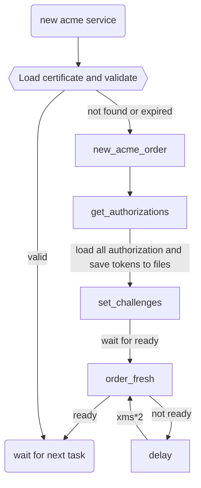
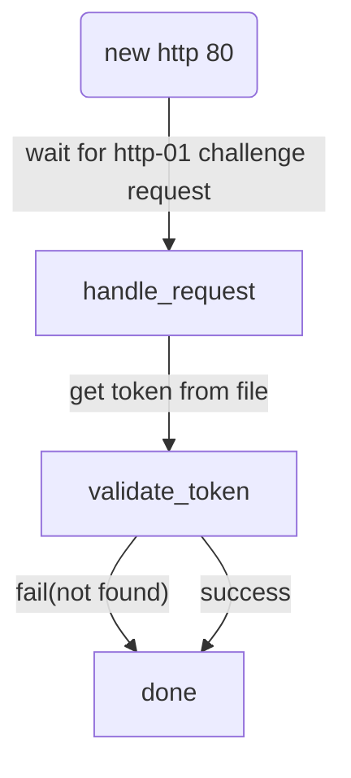

# ACME

### Acme Service

```mermaid
graph TD;
  start("new acme service") --> validate_certificate{{Load certificate and validate}};
  validate_certificate -- not found or expired --> new_acme_order;

  new_acme_order --> get_authorizations;

  get_authorizations -- load all authorization and save tokens to files --> set_challenges;

  set_challenges -- wait for ready --> order_fresh;

  order_fresh -- ready --> done;
  order_fresh -- not ready --> delay;

  delay -- xms*2 --> order_fresh

  validate_certificate -- valid --> done("wait for next task");
```

### Http 01 Challenge

```mermaid
graph TD;
  start("new http 80") -- wait for http-01 challenge request --> handle_request;

  handle_request -- get token from file --> validate_token;

  validate_token -- fail(not found) --> done;

  validate_token -- success --> done;
```
