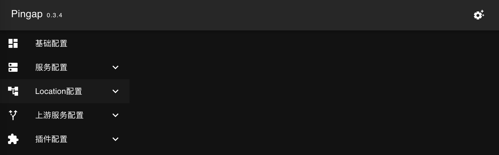
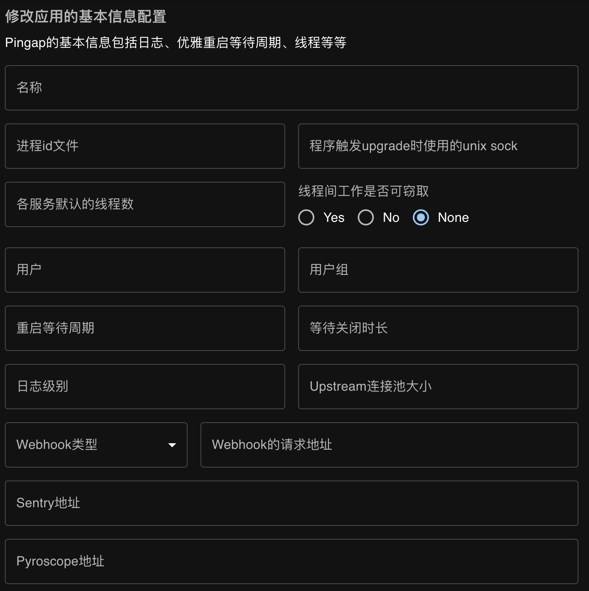
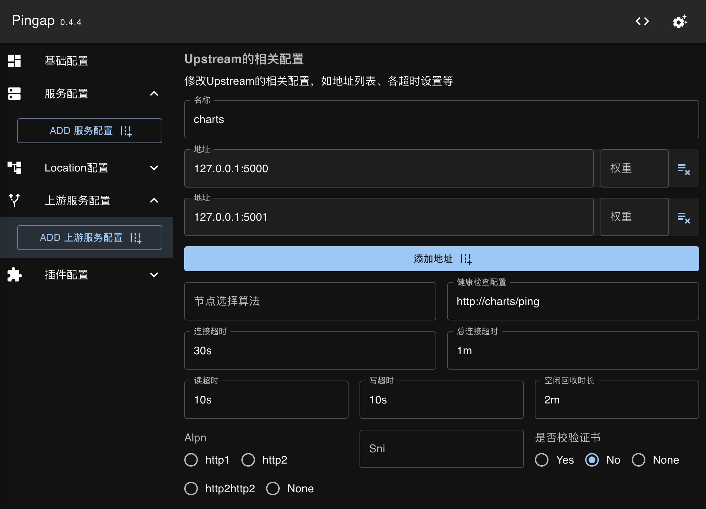
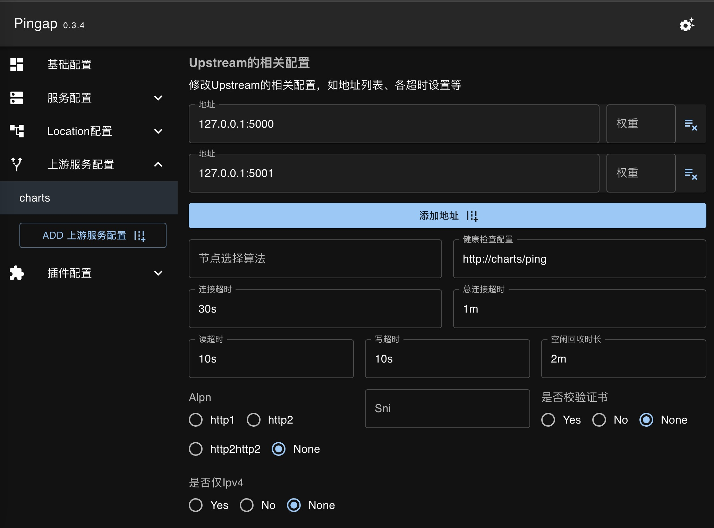
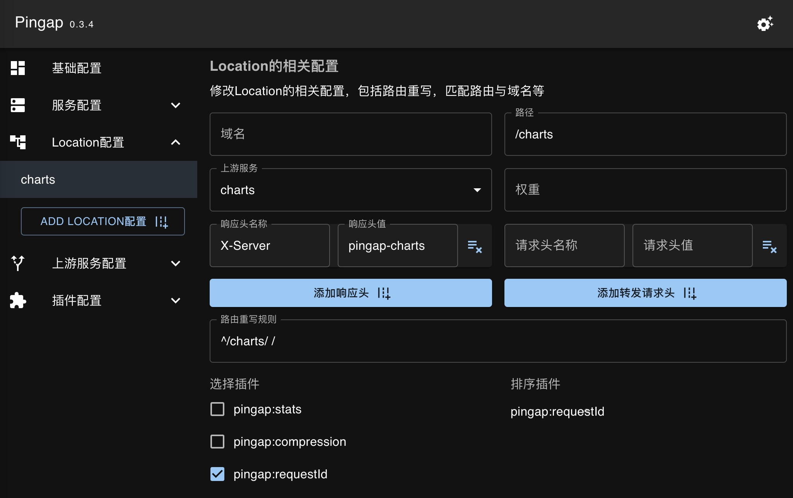
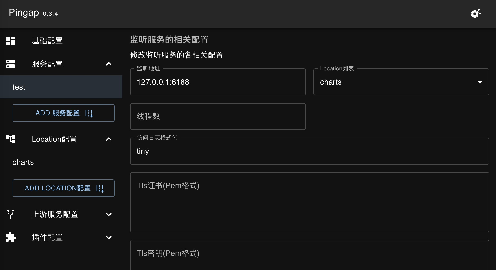
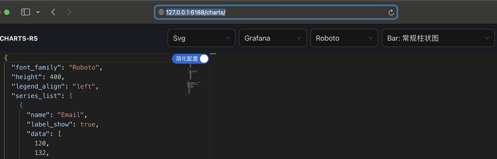

本章节介绍从零开始如何创建反向代理，由于pingora的热更新重启会关闭当前进程，暂时pingap也只能使用此方式,因此以下的示例均是以后台进程的形式运行。pingap在针对常变更的upstream与location增加了准实时刷新机制且无需重启，建议启动时添加`--autoreload`参数。

## 选择存储目录

pingap支持etcd方式存储配置，而文件与etcd的形式仅是启动参数上的差异，因此示例选择使用文件方式存储，方便大家尝试。

pingap保存文件配置中，若指定的是目录则会按类别生成不同的toml配置，若指定的是文件，则所有配置均保存至该文件中，建议使用目录的形式(web admin管理配置时使用此形式)。

```bash
RUST_LOG=INFO pingap -c /opt/pingap/conf
```

选择该目录后，默认会加载该目录下的所有toml配置，由于当前目录为空，暂时无任何实际的效果。

## 启用WEB管理后台配置

toml的相关配置可以查阅[应用配置详细说明](./config_zh.md)，建议可以使用WEB管理后台的方式来匹配。WEB管理后台支持basic auth的方式鉴权（可选），下面通过127.0.0.1:3018端口提供管理后台服务，账号为：pingap，密码为：123123，`cGluZ2FwOjEyMzEyMw==`为base64("pingap:123123")。

```bash
RUST_LOG=INFO pingap -c /opt/pingap/conf --admin=cGluZ2FwOjEyMzEyMw==@127.0.0.1:3018
```

<p align="center">
    
</p>

启动成功后访问`http://127.0.0.1:3018/`可以看到，该界面支持了各类属性配置，后续将一个个讲解。需要注意，管理后台默认针对多次密码错误的IP会锁定5分钟禁止尝试。

## 基础配置

基础配置中一般不需要如何调整，若在同一机器运行多个pingap，则需要设置`进程id文件`与`upgrade sock`这两个配置，避免冲突。若非必要不建议同一机器启动多个pingap实例，若需要监听多端口可通过配置不同的server来实现。

<p align="center">
    
</p>

## 上游服务配置

由于配置中有依赖关系，因此先配置上游服务。点击添加上游服务配置，界面如下：

<p align="center">
    
</p>

地址配置的是`ip:端口`的形式，无需指定协议，默认为http，若有配置`sni`则认为是以https的形式访问上游节点。

需要注意，对于各超时的配置建议按需配置，默认值无超时不建议使用。`sni`与`是否校验证书`用于该upstream的节点使用https时设置，若非https忽略即可。健康检查的`http://charts/ping`其中charts为指定请求时的Host，真正检测时会使用配置upstream地址连接。

<p align="center">
    
</p>

## Location配置

Location主要配置其对应的host与path，以及选择关联对应的上游服务，界面如下：

<p align="center">
    
</p>

host根据提供服务的域名设置，如果多个域名则使用`,`分隔，若所有服务均使用同一域名，也可不设置。 path则是因为一般会基于不同的前缀转发至不同的服务，因此会设置对应的path匹配规则（更多的规则可查询location的详细说明），此处选择了自带的`pingap:requestId`插件，用于生成请求id。需要注意支持的两种请求头处理方式，`设置转发请求头`会覆盖原有的值，例如对于设置`Host`等唯一请求头使用。`添加转发请求头`则不影响原有的值，而是新添加请求头。

## 服务配置

服务配置主要配置该服务监听的服务地址，若要监听多个服务地址，以`,`分隔即可，如`127.0.0.1:3001,[::1]:3001`表示监听Ipv4与Ipv6的`3001`端口。按需配置https相关证书(非https无需设置)，关联对应的location服务，访问日志格式，以及线程数(线程数建议按需配置，或者配置为0则按运行时的CPU核数一致），Tcp keepalive的参数根据应用场景设置即可，界面如下：

<p align="center">
    
</p>

## 程序后台运行及自动重启

程序的配置均已完成，由于此时程序加载的配置非最新版本，因此需要重启程序加载新的配置。Pingap也支持判断配置是否有更新，若有更新则自动触发upgrade的操作，拉起新的实例并关闭当前实例。

最后调整后的程序启动命令为包括以下方面：

- 程序以后台服务运行
- 程序自动检测配置是否更新，若有更新则重启
- 日志写入至/opt/pingap/pingap.log

```bash
RUST_LOG=INFO pingap -c /opt/pingap/conf \
  -d --log=/opt/pingap/pingap.log \
  --autorestart \
  --admin=cGluZ2FwOjEyMzEyMw==@127.0.0.1:3018
```

至此反向代理服务已完成配置，浏览器打开`http://127.0.0.1:6188/charts/`可正常访问，截图如下：

<p align="center">
    
</p>

接着来调整相应的配置，看看实例是否正常重启并生效，将`location`中的path由`/charts`调整为`/pingap`，以及`rewrite`配置，查看日志看看效果如何：

```
INFO 2024-05-03T13:30:05.087916836+08:00 Auto restart background service, should restart:true
INFO 2024-05-03T13:30:05.088470907+08:00 Webhook notification, category:diff_config, message:location:charts
-path = "/charts"
+path = "/pingap"
-rewrite = "^/charts/ /"
+rewrite = "^/pingap/ /"
```

需要注意，因为避免频繁更新配置时导致重复的重启，因此配置检测只会定时运行(现默认为90秒)，而程序重启也会避免过于频繁，因此需要配置更新后，大概需要等待2分钟才会真正触发upgrade操作。部分配置，如`upstream`与`location`等已实现热更新，程序无需重启即可实现配置更新。完成后打`http://127.0.0.1:6188/charts/`，需要注意在linux才可正常的触发upgrade的更新切换。
