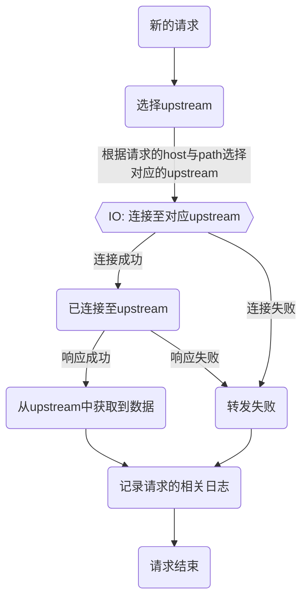

Pingap是基于[pingora](https://github.com/cloudflare/pingora)开发的，pingora提供了各类模块便于rust开发者使用，但并不方便非rust开发者使用，因此pingap提供了以toml的形式配置简单易用的反向代理，在以下流程中接入调整，实现支持多location代理转发。特性如下：

- 可通过请求的路径与域名筛选对应的location
- 支持HTTP1与HTTP2
- 无中断请求的配置更新
- 模板式的请求日志输出

TODO 接入http缓存的逻辑

