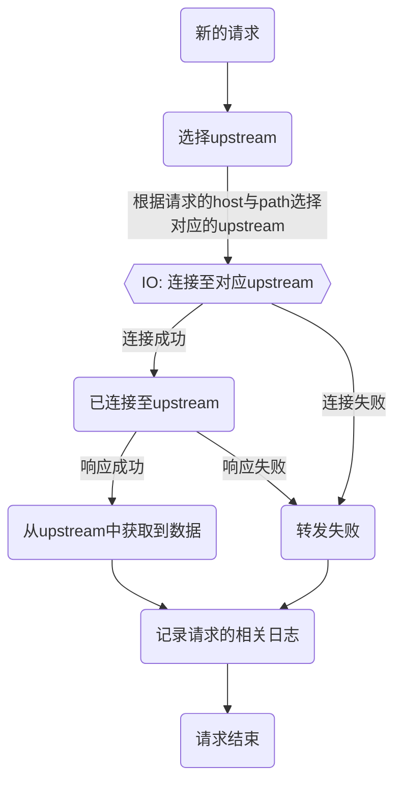

Pingap是基于[pingora](https://github.com/cloudflare/pingora)开发的，pingora提供了各类模块便于rust开发者使用，但并不方便非rust开发者使用，因此pingap提供了以toml的形式配置简单易用的反向代理，在以下流程中接入调整，实现支持多location代理转发。特性如下：

- 可通过请求的路径与域名筛选对应的location
- 支持HTTP1与HTTP2
- 无中断请求的配置更新
- 模板式的请求日志输出

TODO 接入http缓存的逻辑



## Location

Location支持配置对应的host与path规则，path支持以下的规则，权重由高至低：

- 全等模式，配置以`=`开始，如`=/api`表示匹配path等于`/api`的请求
- 正则模式，配置以`~`开始，如`~^/(api|rest)`表示匹配path以`/api`或`/rest`开始请求
- 前缀模式，如`/api`表示匹配path为`/api`开始的请求

在server中会根据所添加的所有location列表，计算对应的权重重新排序，location的计算权限逻辑如下：

```rust
pub fn get_weight(conf: &LocationConf) -> u8 {
    // path starts with
    // = 8
    // prefix(default) 4
    // ~ 2
    // host exist 1
    let mut weighted: u8 = 0;
    if let Some(path) = &conf.path {
        if path.starts_with('=') {
            weighted += 8;
        } else if path.starts_with('~') {
            weighted += 2;
        } else {
            weighted += 4;
        }
    };
    if conf.host.is_some() {
        weighted += 1;
    }
    weighted
}
```
