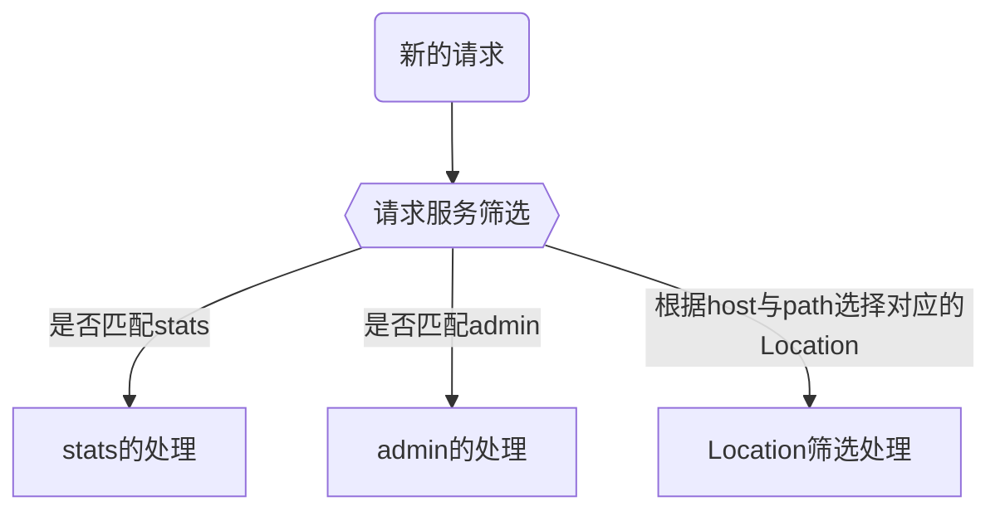

Pingap是基于[pingora](https://github.com/cloudflare/pingora)开发的，pingora提供了各类模块便于rust开发者使用，但并不方便非rust开发者使用，因此pingap提供了以toml的形式配置简单易用的反向代理，实现支持多location代理转发。特性如下：

- 可通过请求的路径与域名筛选对应的location
- 支持静态文件目录处理
- 支持mock的响应配置
- 支持HTTP1与HTTP2
- 无中断请求的配置更新
- 模板式的请求日志输出

TODO 接入http缓存的逻辑

[Pingap处理流程](./phase_chart_zh.md)

## 根据请求的路径选择对应的服务

Pingap支持两种特别的服务类型，以及常规的反向代理服务，具体如下：

- `Stats`: 获取Server所对应的性能指标
- `Admin`: 根据启动时指定的admin地址或者配置的`admin path`转发至对应的管理后台服务
- `其它`: 常规的反向代理服务，根据域名与路径选择对应的转发节点



## Location的处理逻辑

该Server下的所有location在初始化时根据权重按高至低排序，接受到请求时按顺序一个个匹配到符合的location为止，若无符合的则返回出错。根据符合的location重写path(若无则不需要)，添加请求头(若无则不需要)，成功响应时添加响应头(若无则不需要)。

```rust
let header = session.req_header_mut();
let path = header.uri.path();
let host = header.uri.host().unwrap_or_default();

let (location_index, lo) = self
    .locations
    .iter()
    .enumerate()
    .find(|(_, item)| item.matched(host, path))
    .ok_or_else(|| pingora::Error::new_str(LOCATION_NOT_FOUND))?;
```

[Location的详细说明](./location_zh.md)
