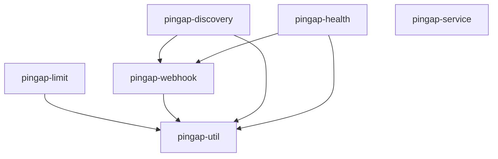

# Pingap Module Dependencies

```mermaid
graph TD

    util[pingap-util]
    limit[pingap-limit]
    webhook[pingap-webhook]
    discovery[pingap-discovery]
    health[pingap-health]
    service[pingap-service]

    limit --> util
    webhook --> util
    discovery --> util
    health --> util

    discovery --> webhook
    health --> webhook
```
