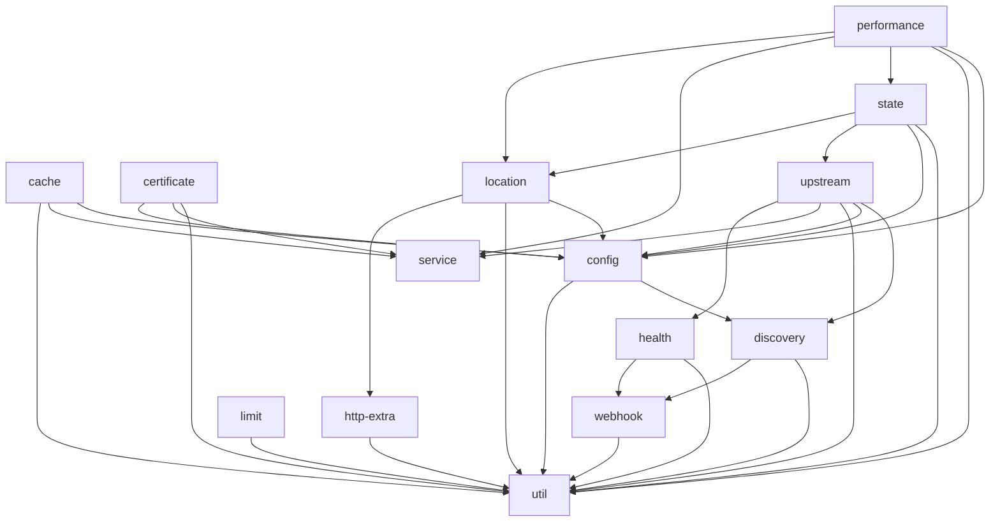

# Pingap Module Dependencies

```mermaid
graph TD
    cache --> util
    cache --> service
    cache --> config

    certificate --> config
    certificate --> service
    certificate --> util

    config --> util
    config --> discovery

    discovery --> webhook
    discovery --> util

    health --> webhook
    health --> util

    http-extra --> util

    limit --> util

    location --> http-extra
    location --> util
    location --> config

    performance --> location
    performance --> service
    performance --> state
    performance --> util
    performance --> config

    state --> location
    state --> upstream
    state --> config
    state --> util

    upstream --> health
    upstream --> service
    upstream --> util
    upstream --> config
    upstream --> discovery

    webhook --> util
```
