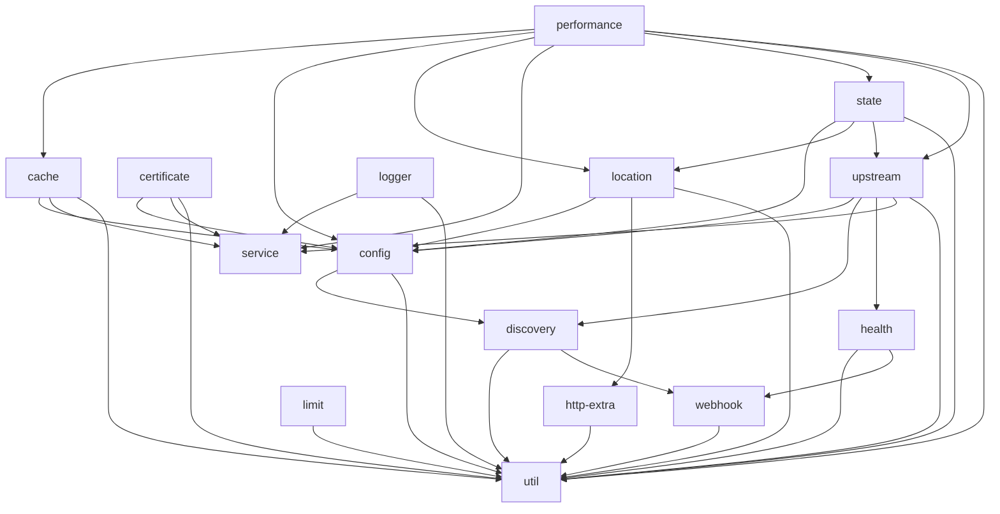

# Pingap Module Dependencies

```mermaid
graph TD
    cache --> config
    cache --> service
    cache --> util

    certificate --> config
    certificate --> service
    certificate --> util

    config --> discovery
    config --> util

    discovery --> util
    discovery --> webhook

    health --> util
    health --> webhook

    http-extra --> util

    limit --> util

    location --> config
    location --> http-extra
    location --> util

    logger --> service
    logger --> util

    performance --> cache
    performance --> config
    performance --> location
    performance --> service
    performance --> state
    performance --> upstream
    performance --> util

    state --> config
    state --> location
    state --> upstream
    state --> util

    upstream --> config
    upstream --> discovery
    upstream --> health
    upstream --> service
    upstream --> util

    webhook --> util
```
