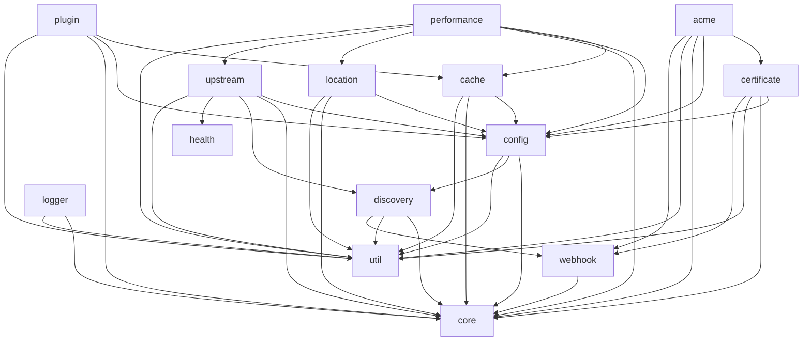

# Pingap Modules 

- `acme`: ACME modules - Handles Automated Certificate Management Environment (ACME) protocol for automated SSL/TLS certificate issuance and renewal
- `cache`: Cache modules - Manages caching mechanisms for improved performance and reduced backend load
- `certificate`: Certificate modules - Handles SSL/TLS certificate management, storage, and validation
- `config`: Configuration modules - Provides configuration management and parsing functionality
- `core`: Core modules - Contains essential functionality and shared components used across other modules
- `discovery`: Discovery modules - Implements service discovery mechanisms for dynamic backend detection
- `health`: Health modules - Manages health checks and monitoring of backend services
- `location`: Location modules - Handles URL routing and location-based request processing
- `logger`: Logger modules - Provides logging functionality and log management
- `otel`: OpenTelemetry modules - Implements OpenTelemetry integration for distributed tracing and metrics
- `performance`: Performance modules - Provides performance metrics and monitoring
- `plugin`: Plugin modules - Manages plugin system for extending functionality
- `pyroscope`: Pyroscope modules - Integrates with Pyroscope for continuous profiling
- `sentry`: Sentry modules - Provides error tracking and monitoring via Sentry integration
- `upstream`: Upstream modules - Manages backend server connections and load balancing
- `util`: Utility modules - Contains shared utility functions and helper methods
- `webhook`: Webhook modules - Supports several webhook protocols for sending notifications to external services

