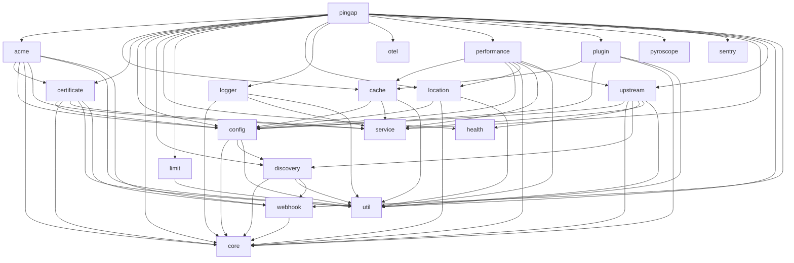

# Pingap Modules 

```mermaid
graph TD
    acme --> certificate
    acme --> config
    acme --> core
    acme --> service
    acme --> util
    acme --> webhook

    cache --> config
    cache --> service
    cache --> util

    certificate --> config
    certificate --> core
    certificate --> service
    certificate --> util
    certificate --> webhook

    config --> core
    config --> discovery
    config --> util

    discovery --> core
    discovery --> util
    discovery --> webhook

    limit --> util

    location --> config
    location --> core
    location --> util

    logger --> core
    logger --> service
    logger --> util

    performance --> cache
    performance --> config
    performance --> core
    performance --> location
    performance --> service
    performance --> upstream
    performance --> util

    plugin --> cache
    plugin --> config
    plugin --> core
    plugin --> util

    upstream --> config
    upstream --> core
    upstream --> discovery
    upstream --> health
    upstream --> service
    upstream --> util

    webhook --> core

    pingap --> acme
    pingap --> cache
    pingap --> certificate
    pingap --> config
    pingap --> core
    pingap --> discovery
    pingap --> health
    pingap --> limit
    pingap --> location
    pingap --> logger
    pingap --> otel
    pingap --> performance
    pingap --> plugin
    pingap --> pyroscope
    pingap --> sentry
    pingap --> service
    pingap --> upstream
    pingap --> util
    pingap --> webhook
```
