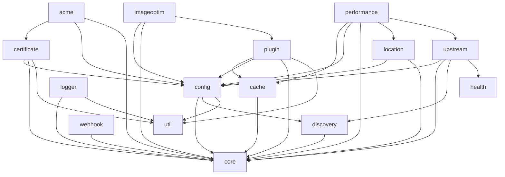

# Pingap Modules 

- `acme`: Handles Automated Certificate Management Environment (ACME) protocol for automated SSL/TLS certificate issuance and renewal
- `cache`: Manages caching mechanisms for improved performance and reduced backend load
- `certificate`: Handles SSL/TLS certificate management, storage, and validation
- `config`: Provides configuration management and parsing functionality
- `core`: Contains essential functionality and shared components used across other modules
- `discovery`: Implements service discovery mechanisms for dynamic backend detection
- `health`: Manages health checks and monitoring of backend services
- `location`: Handles URL routing and location-based request processing
- `logger`: Provides logging functionality and log management
- `otel`: Implements OpenTelemetry integration for distributed tracing and metrics
- `performance`: Provides performance metrics 
- `plugin`: Manages plugin system for extending functionality
- `pyroscope`: Integrates with Pyroscope for continuous profiling
- `sentry`: Provides error tracking and monitoring via Sentry integration
- `upstream`: Manages backend server connections and load balancing
- `util`: Contains shared utility functions and helper methods
- `webhook`: Supports several webhook protocols for sending notifications to external services

