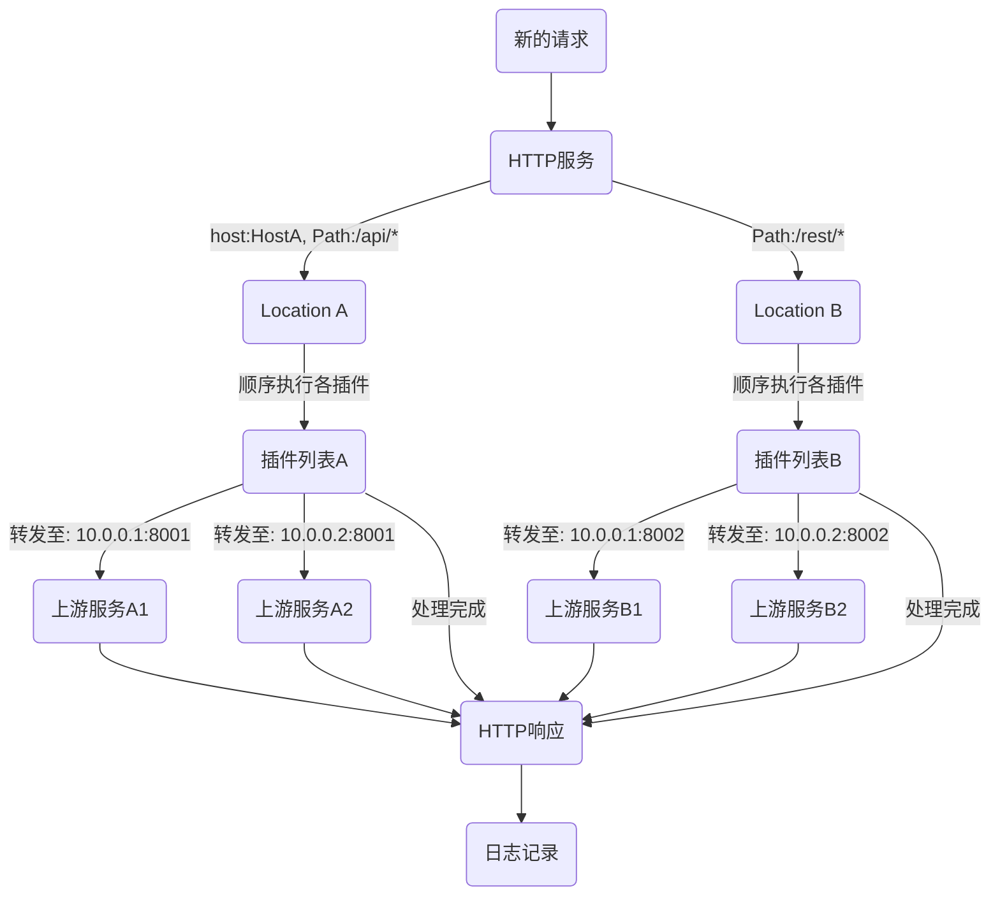

```mermaid
graph TD;
    start("新的请求")-->server("HTTP服务");

    server -- "host:HostA, Path:/api/*" --> locationA("Location A")

    server -- "Path:/rest/*"--> locationB("Location B")

    locationA -- "顺序执行各插件" --> locationPluginListA("插件列表A")

    locationB -- "顺序执行各插件" --> locationPluginListB("插件列表B")

    locationPluginListA -- "转发至: 10.0.0.1:8001" --> upstreamA1("上游服务A1") --> response

    locationPluginListA -- "转发至: 10.0.0.2:8001" --> upstreamA2("上游服务A2") --> response

    locationPluginListA -- "处理完成" --> response

    locationPluginListB -- "转发至: 10.0.0.1:8002" --> upstreamB1("上游服务B1") --> response

    locationPluginListB -- "转发至: 10.0.0.2:8002" --> upstreamB2("上游服务B2") --> response

    locationPluginListB -- "处理完成" --> response

    response("HTTP响应") --> stop("日志记录");
```

Pingap核心部分功能主要处理以下逻辑(由插件实现更丰富的功能)：

- 根据path与host选择对应的location
- location根据配置重写path以及添加相应的请求头
- location根据配置添加相应的响应头
- 根据配置的日志格式输出对应的访问日志
