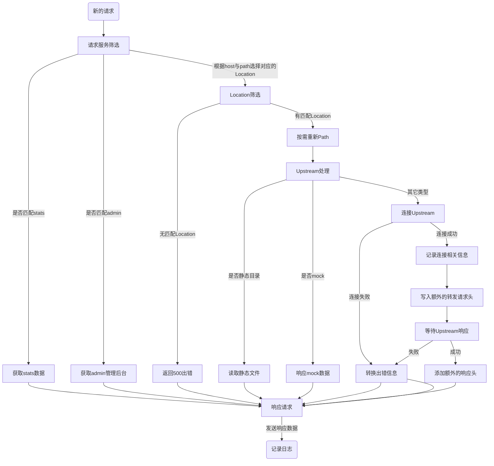

```mermaid
graph TD;
    start("新的请求")-->请求服务筛选;
    请求服务筛选--是否匹配stats-->获取stats数据-->响应请求;
    请求服务筛选--是否匹配admin-->获取admin管理后台-->响应请求;
    请求服务筛选--根据host与path选择对应的Location-->Location筛选;
    Location筛选--无匹配Location-->返回500出错-->响应请求;
    Location筛选--有匹配Location-->按需重新Path-->Upstream处理;
    Upstream处理--是否静态目录-->读取静态文件-->响应请求;
    Upstream处理--是否mock-->响应mock数据-->响应请求;
    Upstream处理--其它类型-->连接Upstream;
    连接Upstream--连接失败-->转换出错信息-->响应请求;
    连接Upstream--连接成功-->记录连接相关信息-->写入额外的转发请求头-->等待Upstream响应;
    等待Upstream响应--成功-->添加额外的响应头-->响应请求;
    等待Upstream响应--失败-->转换出错信息-->响应请求;

    响应请求--发送响应数据-->stop("记录日志");
```
