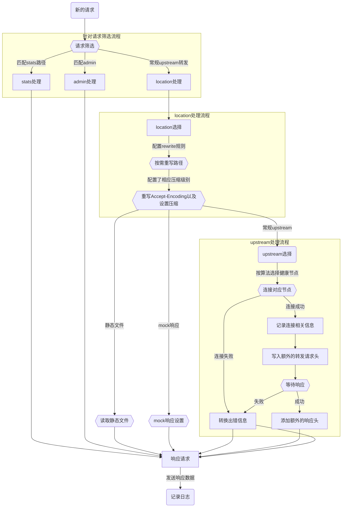

```mermaid
flowchart TB
    start("新的请求")-->requestFilter{{请求筛选}};
    subgraph 针对请求筛选流程
    requestFilter--匹配stats路径-->stats处理
    requestFilter--匹配admin-->admin处理
    requestFilter--常规upstream转发-->location处理
    end

    stats处理-->响应请求
    admin处理-->响应请求
    location处理-->location选择
    subgraph location处理流程
    location选择--配置rewrite规则-->rewritePath{{按需重写路径}}
    rewritePath--配置了相应压缩级别-->modifyAcceptEncoding{{重写Accept-Encoding以及设置压缩}}
    end
    modifyAcceptEncoding--静态文件-->staticService{{读取静态文件}}
    modifyAcceptEncoding--mock响应-->mockService{{mock响应设置}}
    modifyAcceptEncoding--常规upstream-->upstreamSelect("upstream选择")

    subgraph upstream处理流程
    upstreamSelect--按算法选择健康节点-->connectUpstream{{连接对应节点}}
    connectUpstream--连接失败-->转换出错信息
    connectUpstream--连接成功-->记录连接相关信息-->写入额外的转发请求头-->upstreamResponse{{等待响应}}
    upstreamResponse--成功-->添加额外的响应头
    upstreamResponse--失败-->转换出错信息
    end

    staticService-->响应请求
    mockService-->响应请求
    转换出错信息-->响应请求
    添加额外的响应头-->响应请求
    转换出错信息-->响应请求
    响应请求--发送响应数据-->stop("记录日志")
```
