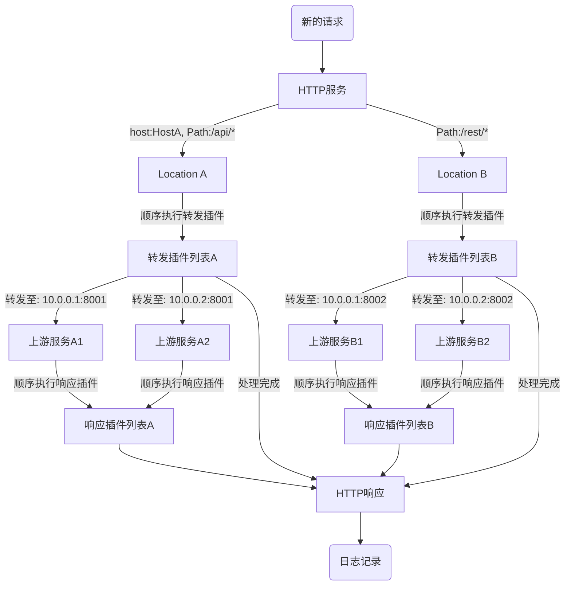

```mermaid
graph TD;
    server["HTTP服务"];
    locationA["Location A"];
    locationB["Location B"];
    locationPluginListA["转发插件列表A"];
    locationPluginListB["转发插件列表B"];
    upstreamA1["上游服务A1"];
    upstreamA2["上游服务A2"];
    upstreamB1["上游服务B1"];
    upstreamB2["上游服务B2"];
    locationResponsePluginListA["响应插件列表A"];
    locationResponsePluginListB["响应插件列表B"];

    start("新的请求") --> server

    server -- "host:HostA, Path:/api/*" --> locationA

    server -- "Path:/rest/*"--> locationB

    locationA -- "顺序执行转发插件" --> locationPluginListA

    locationB -- "顺序执行转发插件" --> locationPluginListB

    locationPluginListA -- "转发至: 10.0.0.1:8001" --> upstreamA1

    locationPluginListA -- "转发至: 10.0.0.2:8001" --> upstreamA2

    locationPluginListA -- "处理完成" --> response

    locationPluginListB -- "转发至: 10.0.0.1:8002" --> upstreamB1

    locationPluginListB -- "转发至: 10.0.0.2:8002" --> upstreamB2

    locationPluginListB -- "处理完成" --> response

    upstreamA1 -- "顺序执行响应插件" --> locationResponsePluginListA
    upstreamA2 -- "顺序执行响应插件" --> locationResponsePluginListA

    upstreamB1 -- "顺序执行响应插件" --> locationResponsePluginListB
    upstreamB2 -- "顺序执行响应插件" --> locationResponsePluginListB

    locationResponsePluginListA --> response
    locationResponsePluginListB --> response

    response["HTTP响应"] --> stop("日志记录");
```

Pingap核心部分功能主要处理以下逻辑(由插件实现更丰富的功能)：

- 根据path与host选择对应的location
- 执行相应的转发中间件
- location根据配置重写path以及添加相应的请求头
- 执行相应的响应中间件
- 根据配置的日志格式输出对应的访问日志
