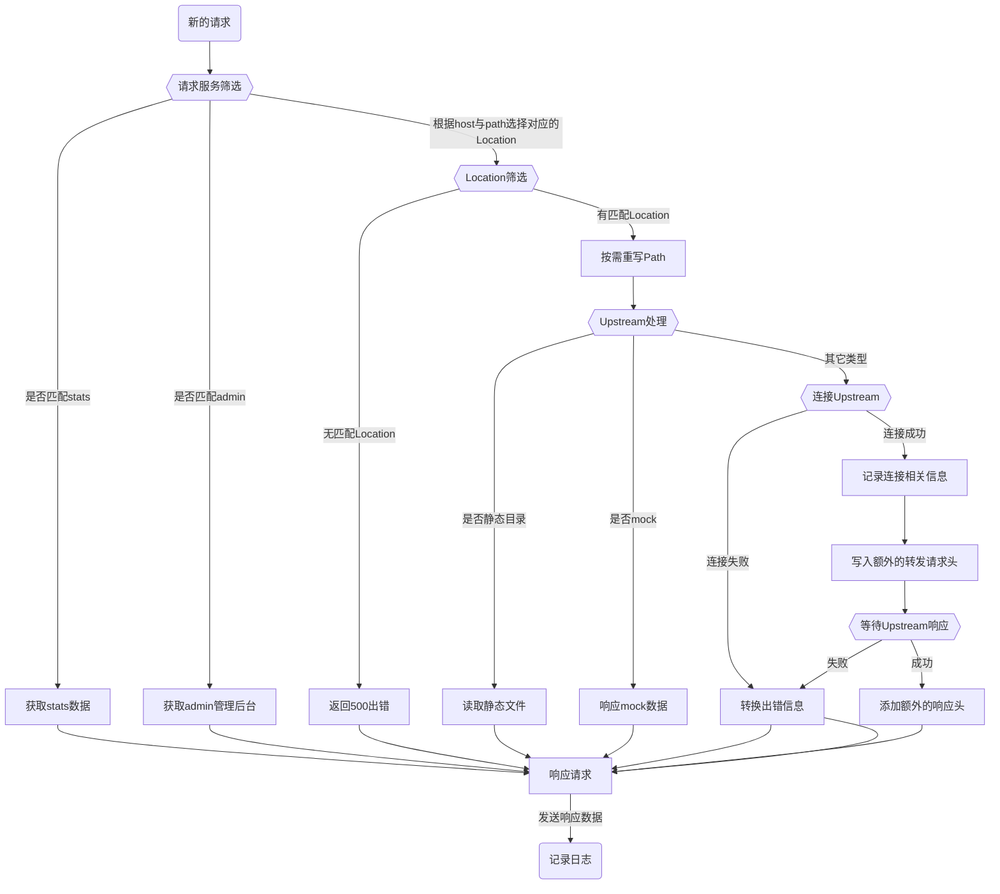

```mermaid
graph TD;
    start("新的请求")-->ServiceFilter{{请求服务筛选}};
    ServiceFilter--是否匹配stats-->获取stats数据-->响应请求;
    ServiceFilter--是否匹配admin-->获取admin管理后台-->响应请求;
    ServiceFilter--根据host与path选择对应的Location-->LocationFilter{{Location筛选}};
    LocationFilter--无匹配Location-->返回500出错-->响应请求;
    LocationFilter--有匹配Location-->按需重写Path-->UpstreamHandle{{Upstream处理}};
    UpstreamHandle--是否静态目录-->读取静态文件-->响应请求;
    UpstreamHandle--是否mock-->响应mock数据-->响应请求;
    UpstreamHandle--其它类型-->UpstreamServe{{连接Upstream}};
    UpstreamServe--连接失败-->转换出错信息-->响应请求;
    UpstreamServe--连接成功-->记录连接相关信息-->写入额外的转发请求头-->UpstreamResponse{{等待Upstream响应}};
    UpstreamResponse--成功-->添加额外的响应头-->响应请求;
    UpstreamResponse--失败-->转换出错信息-->响应请求;

    响应请求--发送响应数据-->stop("记录日志");
```
