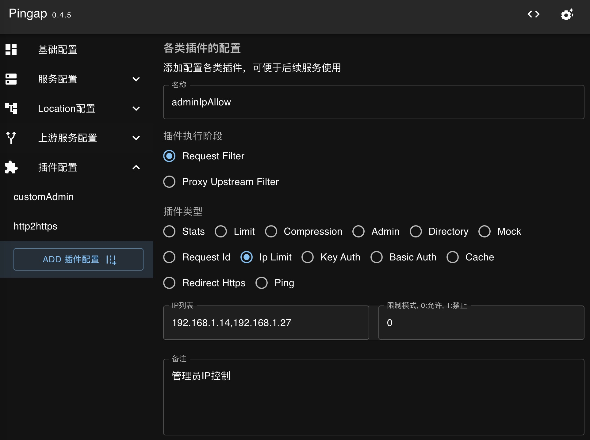

Pingap中通过Locaton添加各种插件支持更多的应用场景，如鉴权、流控等。现在插件支持在`request_filter`与`proxy_upstream_filter`阶段执行，均为转发到上游节点前的处理。下面介绍一下`proxy plunin`的具体逻辑，trait如下：

```rust
#[async_trait]
pub trait ProxyPlugin: Sync + Send {
    fn category(&self) -> ProxyPluginCategory;
    fn step(&self) -> ProxyPluginStep;
    async fn handle(
        &self,
        _session: &mut Session,
        _ctx: &mut State,
    ) -> pingora::Result<Option<HttpResponse>> {
        Ok(None)
    }
}
```

主要分三个实现：

- `category`: 插件类型，用于区分该插件是哪类形式的插件
- `step`: 插件的执行阶段，现只支持在`request_filter`与`proxy_upstream_filter`阶段执行
- `handle`: 插件的执行逻辑，若返回的是`Ok(Some(HttpResponse))`，则表示请求已处理完成，不再转发到上游节点，并将该响应传输至请求端

## Stats

获取应用性能指标等统计性能，配置是指定对应的访问路径即可，也可直接使用自带的`pingap:stats`。如配置为`/stats`后，访问该location的`/stats`目录即可获取到应用的统计指标。具体配置如下：

```toml
[proxy_plugins.stats]
value = "/stats"
category = "stats""
```

界面配置如图所示，主要是配置其对应的请求路径即可：

<p align="center">
    
</p>

## Limit

可基于cookie、请求头或query参数来限制并发访问，需要注意此限制只是限制并发数而非访问频率，以及若配置的字段获取到的值为空，则不限制。

根据cookie的`bigtree`限制并发数为`10`:

```toml
[proxy_plugins.cookieBigTreeLimit]
value = "~bigtree 10"
category = "limit"
```

根据请求头的`X-App`参数限制并发数`10`:

```toml
[proxy_plugins.headerAppLimit]
value = ">X-App 10"
category = "limit"
```

根据query中的`app`参数限制并发数`10`:

```toml
[proxy_plugins.queryAppLimit]
value = "?query 10"
category = "limit"
```

根据ip限制并发数`10`(ip获取的顺序为X-Forwarded-For --> X-Real-Ip --> Remote Addr):

```toml
[proxy_plugins.ipLimit]
value = "ip 10"
category = "limit"
```

界面配置如图所示，主要是配置限制条件以及对应的最大并发访问量：

<p align="center">
    
</p>

## Compression

压缩中间件，处理从上游返回的相关数据压缩，由于`pingora`对于压缩的匹配顺序为`gzip --> br --> zstd`，官方暂未支持调整优先级，而对于现代浏览器，基本都支持`gzip`，大部分支持`br`，少部分支持`zstd`，为了使用更好的压缩方式，此插件会调整请求的`Accept-Encoding`，让压缩的顺序调整为`zstd --> br --> gzip`。配置如下：

```toml
[proxy_plugins.commonCompression]
value = "6 6 5"
category = "compression"
```

需要注意`value`部分对应的是三个压缩方式的压缩级别，分别为`gzip`，`br`与`zstd`，若不需要使用的则设置为0即可。也可使用自带的`pingap:compression`，它的压缩级别配置为`6 6 3`。

界面配置如图所示，按需分别配置对应的压缩级别即可，若不想启用该压缩算法则配置为0：

<p align="center">
    
</p>

## Directory

静态文件目录服务，为指定目录提供静态文件服务，需要注意query部分的参数均为可选值，说明如下：

- `chunk_size`: Http chunk的大小，默认为`8192`
- `max_age`: 设置http响应的的缓存时间，默认无。此值对于`text/html`无效，html均设置为不可缓存
- `private`: 缓存是否设置为`private`，默认为`public`
- `index`: 设置默认的index文件，默认为`index.html`
- `charset`: 指定charset类型，默认无
- `autoindex`: 是否允许目录以浏览形式展示

```toml
[proxy_plugins.downloadsServe]
value = "~/Downloads?chunk_size=4096&max_age=3600&private&index=index.html&charset=utf-8"
category = "directory"
```

界面配置如图所示，配置对应的静态文件目录，并按需要添加对应的query参数即可：

<p align="center">
    
</p>

## Mock

用于对特定路径(若不设置则所有)mock响应，用于测试或暂停服务使用。

```toml
[proxy_plugins.errorMock]
value = '{"status":500,"path":"/","headers":["X-Error:custom error","Content-Type:application/json"],"data":"{\n  \"message\": \"error message\"\n}"}'
category = "mock"
```

## RequestId

用于在请求头中添加`"X-Request-Id`，若已有则忽略，可指定使用`uuid`或`nanoid`两种形式，`nanoid`可以指定长度。

```toml
[proxy_plugins.customReqId]
value = "nanoid 8"
category = "request_id"
```

界面配置如图所示，算法类型若不是`nanoid`，其它的值均表示`uuid`。长度也只针对`nanoid`生效：

<p align="center">
    
</p>

## IpLimit

Ip限制分为两种模式，允许(0)，禁止(1)，ip可支持配置为单ip或ip组，配置如下：

```toml
[proxy_plugins.ipDeny]
value = "192.168.1.1,1.1.1.0/24 1"
category = "ip_limit"
```

界面配置如图所示，配置IP列表后，填写是允许还是禁止即可：

<p align="center">
    
</p>

## KeyAuth

KeyAuth用于提供简单的认证方式，支持配置从query(以?开头)或header中获取值，校验的key值可配置多个，以','分隔，并校验是否符合。

从query中的app字段中获取校验：

```toml
[proxy_plugins.appAuth]
value = "?app KOXQaw,GKvXY2"
category = "key_auth"
```

从header中的X-App字段中获取校验：

```toml
[proxy_plugins.appAuth]
value = "X-App KOXQaw,GKvXY2"
category = "key_auth"
```

界面配置如图所示，配置key的名称(query需要加前缀?)，再配置符合的值(多个值用,分隔)即可：

<p align="center">
    
</p>

## BasicAuth

BasicAuth鉴权，配置时需要使用保存`base64(user:pass)`的值，若有多个则可以使用`,`分隔。

```toml
[proxy_plugins.testBasicAuth]
value = "YWRtaW46dGVzdA==,YWRtaW46MTIzMTIz"
category = "basic_auth"
```

界面配置如图所示，配置basic auth的值(多个值用,分隔)，需要注意配置已做base64处理后的值即可：

<p align="center">
    
</p>

## Cache

Http缓存，仅支持内存式缓存，暂不建议使用。

## RedirectHttps

重定向http至https，可在重定向时添加前缀。

```toml
[proxy_plugins.http2https]
category = "redirect_https"
```

界面配置如图所示，若需要重定向时添加前缀，可配置对应的前缀，若无需要调整则不配置值即可：

<p align="center">
    
</p>

## Ping

Ping->pong的响应处理，可用于判断程序是否正常运行等。

```toml
[proxy_plugins.pingpong]
category = "ping"
value = "/ping"
```
