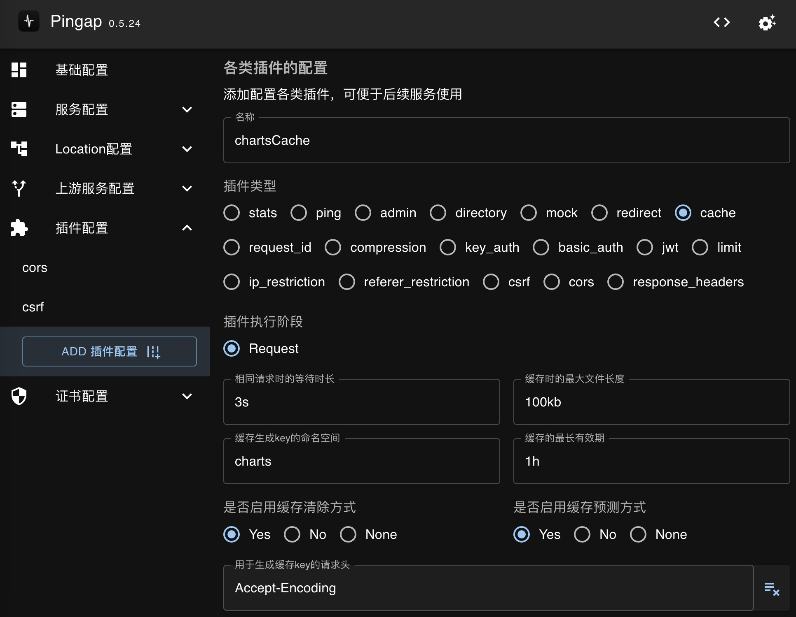
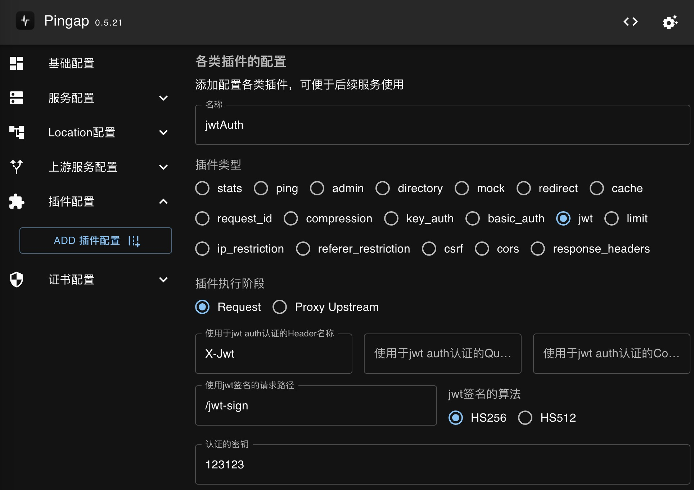
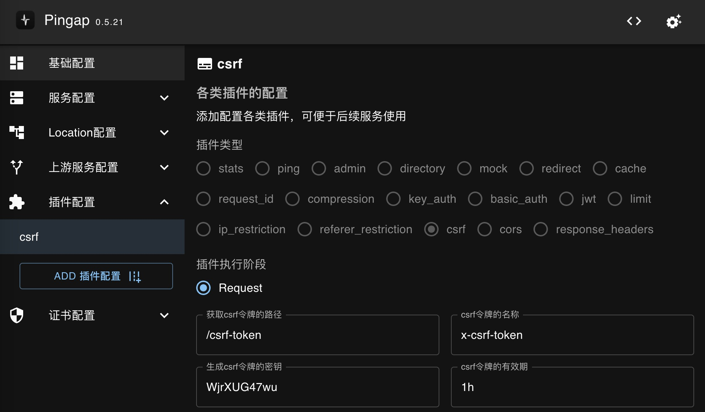
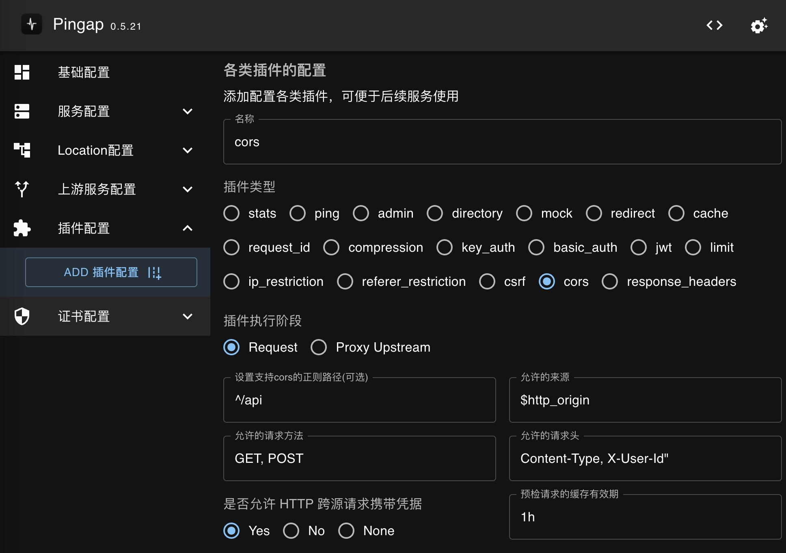

Pingap中通过Locaton添加各种插件支持更多的应用场景，如鉴权、流控、设置响应头等场景。

# 插件执行时点

现支持将插件添加到以下各阶段时点中执行：

- `Request`: 请求的最开始阶段，适用于针对一些权限类的拦截等处理
- `ProxyUpstream`: 请求转发至上流节点之前，因为此流程是在读取缓存之后，因此若不希望针对缓存前限制，但转发至上游前限制的可配置为此阶段。如限制IP访问频繁，但允许高并发读取缓存数据。
- `Response`: 上游数据响应之后，用于针对上游响应数据做调整时使用。

```rust
#[async_trait]
pub trait Plugin: Sync + Send {
    fn category(&self) -> PluginCategory;
    fn step(&self) -> String;
    async fn handle_request(
        &self,
        _step: PluginStep,
        _session: &mut Session,
        _ctx: &mut State,
    ) -> pingora::Result<Option<HttpResponse>> {
        Ok(None)
    }
    async fn handle_response(
        &self,
        _step: PluginStep,
        _session: &mut Session,
        _ctx: &mut State,
        _upstream_response: &mut ResponseHeader,
    ) -> pingora::Result<Option<Bytes>> {
        Ok(None)
    }
}

```

主要分三个实现：

- `category`: 插件类型，用于区分该插件是哪类形式的插件
- `step`: 插件的执行阶段，现只支持在`request_filter`与`proxy_upstream_filter`阶段执行
- `handle_request`: 插件的转发前执行逻辑，若返回的是`Ok(Some(HttpResponse))`，则表示请求已处理完成，不再转发到上游节点，并将该响应传输至请求端
- `handle_response`: 插件的响应前执逻辑，若返回的是Ok(Some(Bytes))`，则表示要重写响应数据

## Stats

获取应用性能指标等统计性能，配置是指定对应的访问路径即可，也可直接使用自带的`pingap:stats`。如配置为`/stats`后，访问该location的`/stats`目录即可获取到应用的统计指标。具体配置如下：

```toml
[plugins.stats]
category = "stats"
path = "/stats"
remark = "用于获取性能指标"
```

- `path`: 响应性能指标的路径

界面配置如图所示，主要是配置其对应的请求路径即可：

<p align="center">
    
</p>

## Ping

Ping->pong的响应处理，可用于判断程序是否正常运行等。

```toml
[plugins.pingpong]
category = "ping"
path = "/ping"
```

- `path`: 响应pong的路径

## Admin

管理后台配置，可在现在的现有的location中添加支持管理后台服务，`YWRtaW46MTIzMTIz`为`base64(admin:123123)`，将该配置关联至对应location后，即可使用该location的/pingap/访问管理后台，账号为`admin`，密码为`123123`

```toml
[plugins.admin]
authorizations = ["YWRtaW46MTIzMTIz"]
category = "admin"
ip_fail_limit = 10
path = "/pingap"
remark = "管理后台"
```

- `authorizations`: Basic认证的密钥列表
- `ip_fail_limit`: 认证失败时的IP限制次数
- `path`: 管理后台的路径

<p align="center">
    
</p>

## Directory

静态文件目录服务，为指定目录提供静态文件服务，说明如下：

```toml
[plugins.downloadsServe]
category = "directory"
charset = "utf-8"
chunk_size = 4096
index = "index.html"
max_age = "1h"
path = "~/Downloads"
```

- `path`: 静态文件目录路径
- `chunk_size`: Http chunk的大小，默认为`8192`
- `max_age`: 设置http响应的的缓存时间，默认无。此值对于`text/html`无效，html均设置为不可缓存。如设置为`1h`表示缓存有效期1小时
- `private`: 缓存是否设置为`private`，默认为`public`
- `index`: 设置默认的index文件，默认为`index.html`
- `charset`: 指定charset类型，默认无
- `autoindex`: 是否允许目录以浏览形式展示，需要注意若指定了目录允许浏览，则`index`参数无效
- `download`: 是否支持下载，指定该参数后响应时会设置响应头`Content-Disposition`
- `headers`: 需要添加的http响应头列表


界面配置如图所示，配置对应的静态文件目录，并按需要添加对应的query参数即可：

<p align="center">
    
</p>

## Mock

用于对特定路径(若不设置则所有)mock响应，用于测试或暂停服务使用。

```toml
[plugins.errorMock]
category = "mock"
data = "{\"message\": \"error message\"}"
headers = [
    "X-Error:CustomRrror",
    "Content-Type:application/json",
]
path = "/"
status = 500
```

- `data`: Mock的响应数据
- `headers`: Mock的响应头
- `path`: Mock请求的路径，如果不配置则匹配所有
- `status`: Mock响应的状态码

界面配置如图所示，配置对应响应数据既可，需要注意如果指定响应类型，如json等：

<p align="center">
    
</p>

## Redirect

http重定向，可在重定向时添加前缀或指定为https。

```toml
[plugins.http2https]
category = "redirect"
http_to_https = true
prefix = "/api"
```

- `http_to_https`: 是否从http重定向至https
- `prefix`: 重定向时添加的前缀


界面配置如图所示，若需要重定向时添加前缀，可配置对应的前缀，若无需要调整则不配置值即可：

<p align="center">
    
</p>

## Cache

缓存中间件，用于缓存http请求，由于缓存模块是全局使用，因此如果不同的Location均使用缓存，则需要设置不同的namespace。

```toml
[plugins.chartsCache]
category = "cache"
eviction = true
headers = ["Accept-Encoding"]
lock = "3s"
max_file_size = "100kb"
max_ttl = "1h"
namespace = "charts"
predictor = true
```

- `lock`: 缓存不存在时，相同请求的等待时长
- `max_file_size`: 单个缓存文件的最大长度，建议设置合理的值，避免过大的响应缓存在内存中导致内存占用过高
- `namespace`: 由于缓存是应用共享，而缓存的key是基于path+querystring，因此如果是多域名共享时，不同的域名使用不同的缓存中间件，并设置对应的namespace
- `max_ttl`: 设置缓存的最长有效期，一般建议由upstream服务响应时，若`Cache-Control`的`max-age`较长，则设置较短的`s-maxage`，若`upstream`未设置`s-maxage`，可通过此配置限制缓存的最大有效期
- `eviction`: 当缓存超限时，触发缓存清除，需要注意，如tinyufo暂时不支持主动清除
- `predictor`: 是否记录无法缓存的请求，可避免后续重复的等待确认请求是否可缓存


<p align="center">
    
</p>


## RequestId

用于在请求头中添加`X-Request-Id`(也可指定对应的请求头），若已有则忽略，可指定使用`uuid`或`nanoid`两种形式，`nanoid`可以指定长度。

```toml
[plugins.customReqId]
algorithm = "nanoid"
category = "request_id"
size = 8
```

- `algorithm`: 生成请求id的算法
- `size`: 请求id的长度，只对于`nanoid`有效。

界面配置如图所示：

<p align="center">
    
</p>

## Compression

压缩中间件，处理从上游返回的相关数据压缩，由于`pingora`对于压缩的匹配顺序为`gzip --> br --> zstd`，官方暂未支持调整优先级，而对于现代浏览器，基本都支持`gzip`，大部分支持`br`，少部分支持`zstd`，为了使用更好的压缩方式，此插件会调整请求的`Accept-Encoding`，让压缩的顺序调整为`zstd --> br --> gzip`。配置如下：

```toml
[plugins.commonCompression]
br_level = 6
category = "compression"
gzip_level = 6
zstd_level = 5
```

- `br_level`: brotli压缩算法的压缩级别
- `gzip_level`: gzip压缩算法的压缩级别
- `zstd_level`: zstd压缩算法的压缩级别

需要注意三种压缩算法的压缩级别不一样，按需选择即可，也可使用自带的`pingap:compression`，它的压缩级别配置为`gzip_level = 6`, `br_level = 6`, `zstd_level = 3`。

界面配置如图所示，按需分别配置对应的压缩级别即可，若不想启用该压缩算法则配置为0：

<p align="center">
    
</p>

## KeyAuth

KeyAuth用于提供简单的认证方式，支持配置从query或header中获取值，可配置多个校验值，方便多系统接入。

从query中的app字段中获取校验：

```toml
[plugins.appAuth]
category = "key_auth"
hide_credentials = true
keys = [
    "KOXQaw",
    "GKvXY2",
]
query = "app"
```

从header中的X-App字段中获取校验：

```toml
[plugins.appAuth]
category = "key_auth"
hide_credentials = true
header = "X-App"
keys = [
    "KOXQaw",
    "GKvXY2",
]
```

- `hide_credentials`: 转发至upstream时是否删除认证信息
- `query`: 从query中获取认证信息
- `header`: 从请求头中获取认证信息（与query二选一,，使用使用query)
- `keys`: 认证的key列表

界面配置如图所示，配置key的名称，再配置符合的值即可：

<p align="center">
    
</p>

## BasicAuth

BasicAuth鉴权，配置时需要使用保存`base64(user:pass)`的值，若有多个则配置多个即可。

```toml
[plugins.testBasicAuth]
authorizations = [
    "YWRtaW46dGVzdA==",
    "YWRtaW46MTIzMTIz",
]
category = "basic_auth"
hide_credentials = true
```

- `authorizations`: Basic认证的信息，它使用的是base64(user:password)后的数据，可以配置多个
- `hide_credentials`: 转发至upstream时是否删除认证信息

界面配置如图所示，配置basic auth的值，需要注意配置已做base64处理后的值即可：

<p align="center">
    
</p>

## Jwt

用于生成jwt认证信息以及针对相关请求判断jwt相关信息是否符合。需要注意请求路径的响应数据会使用jwt的形式重新签名生成对应的token返回，其它路径则校验其token是否符合。

```toml
[plugins.jwtAuth]
algorithm = "HS256"
auth_path = "/jwt-sign"
category = "jwt"
cookie = ""
header = "X-Jwt"
secret = "123123"
```

- `header`: jwt认证时从header中获取的请求头名（与cookie，query三选一，优先级为header > cookie -> query)
- `cookie`: jwt认证时从cookie中获取的cookie名
- `query`: jwt认证时从query中获取的字段
- `auth_path`: 生成jwt认证信息的路径
- `algorithm`: 认证使用的算法
- `secret`: 认证使用的密钥

<p align="center">
    
</p>


## Limit

可基于cookie、请求头或query参数来限制并发访问，支持`inflight`(并发)与`rate`(访问频率)两种限制类型，若配置的字段获取到的值为空，则不限制，支持`inflight`与`rate`两种限制类型。

根据cookie的`bigtree`限制并发数为`10`:

```toml
[plugins.cookieBigTreeLimit]
category = "limit"
key = "bigtree"
max = 10
tag = "cookie"
type = "inflight"
```

根据请求头的`X-App`参数限制并发数`10`:

```toml
[plugins.headerAppLimit]
category = "limit"
key = "X-App"
max = 10
tag = "header"
type = "inflight"
```

根据query中的`app`参数限制1秒钟仅能访问`10`次:

```toml
[plugins.queryAppLimit]
category = "limit"
interval = "1s""
key = "app"
max = 10
tag = "query"
type = "rate"
```

根据ip限制1分钟最多访问`10`次(ip获取的顺序为X-Forwarded-For --> X-Real-Ip --> Remote Addr):

```toml
[plugins.ipLimit]
category = "limit"
interval = "1m"
max = 10
tag = "ip"
type = "rate"
```

- `type`: 限制的类型，有`inflight`并发限制与`rate`速率限制
- `tag`: 限流的key的获取类型，有`cookie`, `header`，`query`与`ip`
- `key`: 限制使用的key，对于`ip`类型无需指定
- `max`: 限流最大值
- `interval`: 限流间隔，用于`rate`类型

界面配置如图所示，主要是配置限制条件以及对应的最大并发访问量：

<p align="center">
    
</p>

## IpRestriction

Ip限制分为两种模式，允许或禁止，ip可支持配置为单ip或ip组，配置如下：

```toml
[plugins.ipDeny]
category = "ip_restriction"
ip_list = [
    "192.168.1.1",
    "1.1.1.0/24",
]
message = "禁止该IP访问"
type = "deny"
```

- `type`: 类型，是允许还是禁止
- `ip_list`: IP或IP网段列表
- `message`: 拦截时的出错信息

界面配置如图所示，配置IP列表后，填写是允许还是禁止即可：

<p align="center">
    
</p>

## RefererRestriction

Referer限制分为两种模式，允许或禁止，配置时可使用*前缀匹配，配置如下：

```toml
[plugins.referer]
category = "referer_restriction"
message = ""
referer_list = ["*.github.com"]
type = "allow"
```

- `type`: 类型，是允许还是禁止
- `referer_list`: referer列表
- `message`: 拦截时的出错信息

界面配置如图所示，配置Referer列表后，填写是允许还是禁止即可：


<p align="center">
    
</p>


## Csrf

Csrf校验，校验请求时的cookie与请求头的是否一致，若不一致则返回出错。获取令牌的路径则会生成对应的cookie，并设置为非http的模式允许浏览器获取。

```toml
[plugins.csrf]
category = "csrf"
key = "WjrXUG47wu"
name = "x-csrf-toekn"
token_path = "/csrf-token"
ttl = "1h"
```

- `key`: 生成csrf信息时使用的key
- `name`: csrf的名称
- `token_path`: 生成token的目录
- `ttl`: 有效期

<p align="center">
    
</p>

## Cors

Cors插件，用于设置跨域请求相关配置。

```toml
[plugins.cors]
allow_credentials = true
allow_headers = 'Content-Type, X-User-Id"'
allow_methods = "GET, POST"
allow_origin = "$http_origin"
category = "cors"
max_age = "1h"
path = "^/api"
expose_headers = "Content-Type, X-Device"
```

- `allow_credentials`: 是否允许携带认证信息
- `allow_headers`: 允许的请求头
- `allow_methods`: 允许的http方法
- `allow_origin`: 允许的origin，若设置为`$http_origin`则表示按来源设置允许，不建议使用此形式，建议按需设置
- `max_age`: 设置有效期
- `path`: 设置允许cors的路径，可为正则表达式
- `expose_headers`: 暴露给浏览器访问的响应头

<p align="center">
    
</p>

## ResponseHeaders

响应头的插件主要是设置、添加以及删除请求头。若响应头的值设置为`$hostname`表示获取机器的hostname，若以`$`开头的则表示从环境变量中获取对应的值。

```toml
[plugins.commonResponseHeaders]
add_headers = ["X-Server:pingap"]
category = "response_headers"
remove_headers = ["X-User"]
set_headers = ["X-Response-Id:123"]
step = "response"
```

- `add_headers`: 需要添加的响应头
- `set_headers`: 需要设置的响应头，会覆盖原有值
- `remove_headers`: 需要删除的响应头

执行顺序为`add_headers --> remove_headers --> set_headers`。界面配置如图所示，按需要配置要设置、添加或删除的响应头，若不需要则不设置即可：

<p align="center">
    
</p>
