Pingap中通过Locaton添加各种插件支持更多的应用场景，如鉴权、流控、设置响应头等场景。

# 插件执行时点

现支持将插件添加到以下各阶段时点中执行：

- `Request`: 请求的最开始阶段，适用于针对一些权限类的拦截等处理
- `ProxyUpstream`: 请求转发至上流节点之前，因为此流程是在读取缓存之后，因此若不希望针对缓存前限制，但转发至上游前限制的可配置为此阶段。如限制IP访问频繁，但允许高并发读取缓存数据。
- `Response`: 上游数据响应之后，用于针对上游响应数据做调整时使用。

```rust
#[async_trait]
pub trait Plugin: Sync + Send {
    fn category(&self) -> PluginCategory;
    fn step(&self) -> String;
    async fn handle_request(
        &self,
        _step: PluginStep,
        _session: &mut Session,
        _ctx: &mut State,
    ) -> pingora::Result<Option<HttpResponse>> {
        Ok(None)
    }
    async fn handle_response(
        &self,
        _step: PluginStep,
        _session: &mut Session,
        _ctx: &mut State,
        _upstream_response: &mut ResponseHeader,
    ) -> pingora::Result<Option<Bytes>> {
        Ok(None)
    }
}

```

主要分三个实现：

- `category`: 插件类型，用于区分该插件是哪类形式的插件
- `step`: 插件的执行阶段，现只支持在`request_filter`与`proxy_upstream_filter`阶段执行
- `handle_request`: 插件的转发前执行逻辑，若返回的是`Ok(Some(HttpResponse))`，则表示请求已处理完成，不再转发到上游节点，并将该响应传输至请求端
- `handle_response`: 插件的响应前执逻辑，若返回的是Ok(Some(Bytes))`，则表示要重写响应数据

## Stats

获取应用性能指标等统计性能，配置是指定对应的访问路径即可，也可直接使用自带的`pingap:stats`。如配置为`/stats`后，访问该location的`/stats`目录即可获取到应用的统计指标。具体配置如下：

```toml
[plugins.stats]
category = "stats"
path = "/stats"
remark = "用于获取性能指标"
```

界面配置如图所示，主要是配置其对应的请求路径即可：

<p align="center">
    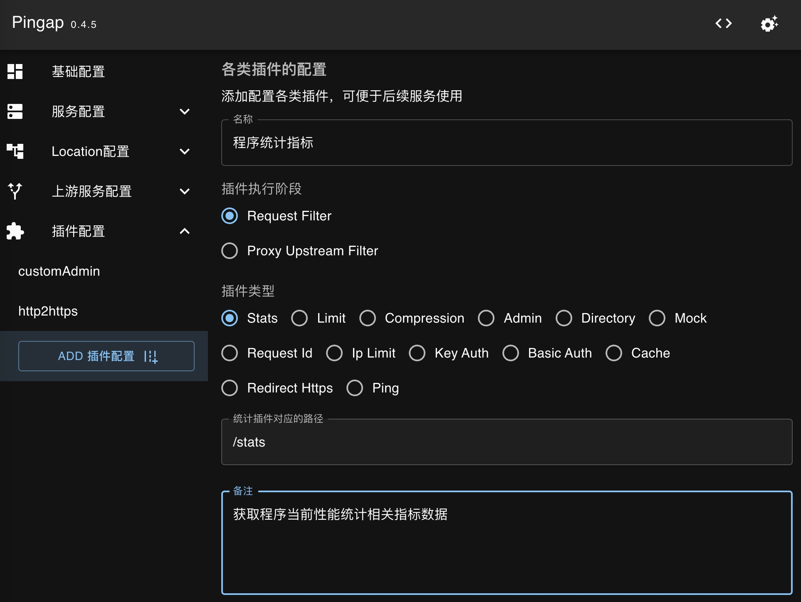
</p>

## Ping

Ping->pong的响应处理，可用于判断程序是否正常运行等。

```toml
[plugins.pingpong]
category = "ping"
path = "/ping"
```

## Admin

管理后台配置，可在现在的现有的location中添加支持管理后台服务，`YWRtaW46MTIzMTIz`为`base64(admin:123123)`，将该配置关联至对应location后，即可使用该location的/pingap/访问管理后台，账号为`admin`，密码为`123123`

```toml
[plugins.admin]
authorizations = ["YWRtaW46MTIzMTIz"]
category = "admin"
ip_fail_limit = 10
path = "/pingap"
remark = "管理后台"
```

<p align="center">
    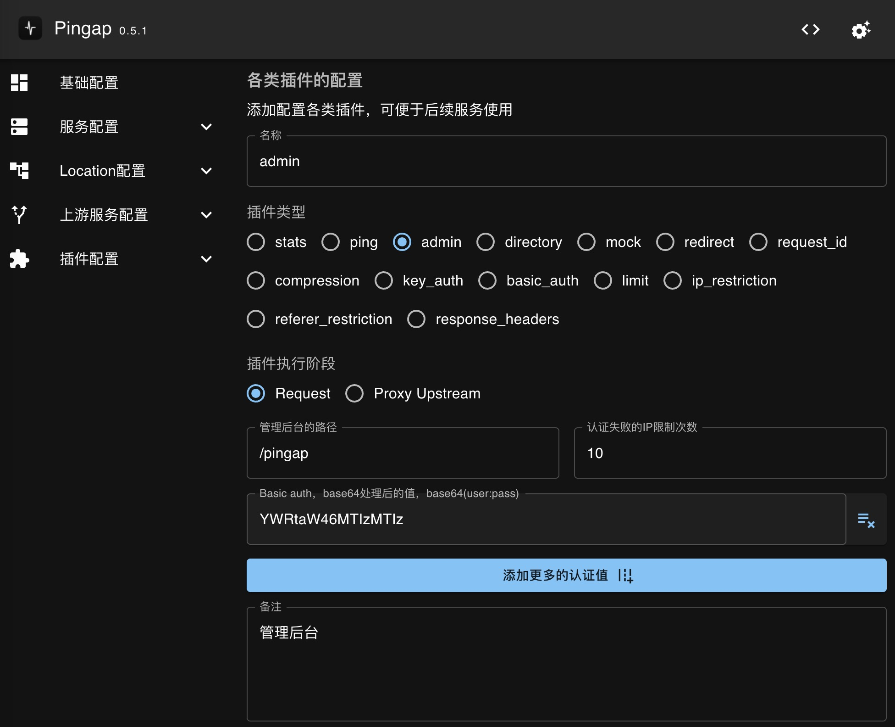
</p>

## Directory

静态文件目录服务，为指定目录提供静态文件服务，说明如下：

- `path`: 静态文件目录路径
- `chunk_size`: Http chunk的大小，默认为`8192`
- `max_age`: 设置http响应的的缓存时间，默认无。此值对于`text/html`无效，html均设置为不可缓存。如设置为`1h`表示缓存有效期1小时
- `private`: 缓存是否设置为`private`，默认为`public1
- `index`: 设置默认的index文件，默认为`index.html`
- `charset`: 指定charset类型，默认无
- `autoindex`: 是否允许目录以浏览形式展示
- `download`: 是否支持下载，指定该参数后响应时会设置响应头`Content-Disposition`
- `headers`:  需要添加的http响应头列表

```toml
[plugins.downloadsServe]
category = "directory"
charset = "utf-8"
chunk_size = 4096
index = "index.html"
max_age = "1h"
path = "~/Downloads"
```

界面配置如图所示，配置对应的静态文件目录，并按需要添加对应的query参数即可：

<p align="center">
    
</p>

## Mock

用于对特定路径(若不设置则所有)mock响应，用于测试或暂停服务使用。

```toml
[plugins.errorMock]
category = "mock"
data = "{\"message\": \"error message\"}"
headers = [
    "X-Error:CustomRrror",
    "Content-Type:application/json",
]
path = "/"
status = 500
```

界面配置如图所示，配置对应响应数据既可，需要注意如果指定响应类型，如json等：

<p align="center">
    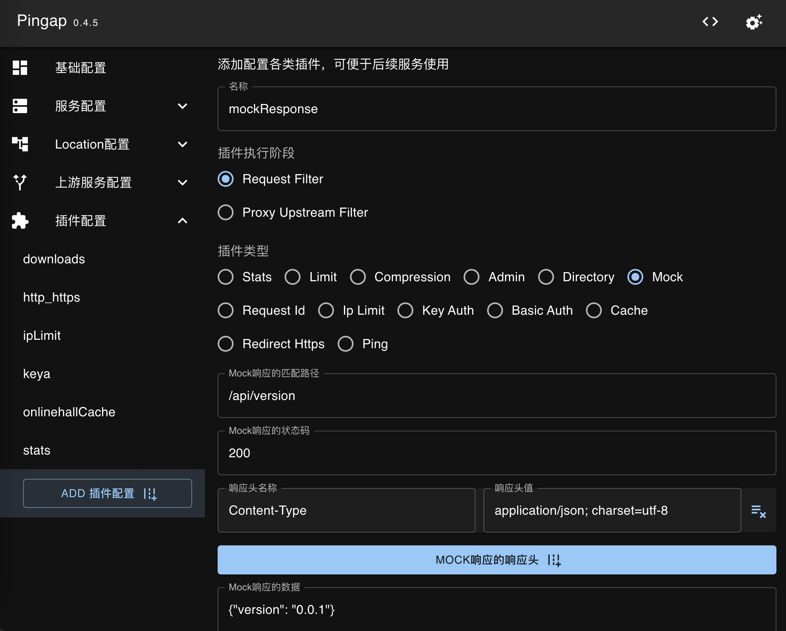
</p>

## Redirect

http重定向，可在重定向时添加前缀或指定为https。

```toml
[plugins.http2https]
category = "redirect"
http_to_https = true
prefix = "/api"
```

界面配置如图所示，若需要重定向时添加前缀，可配置对应的前缀，若无需要调整则不配置值即可：

<p align="center">
    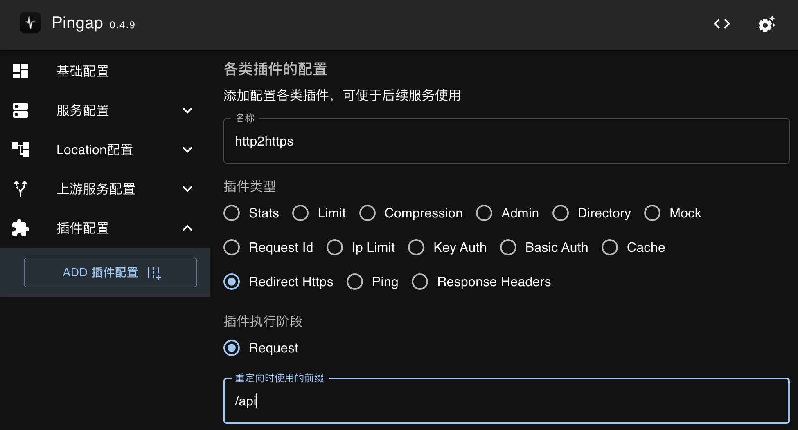
</p>

## RequestId

用于在请求头中添加`X-Request-Id`(也可指定对应的请求头），若已有则忽略，可指定使用`uuid`或`nanoid`两种形式，`nanoid`可以指定长度。

```toml
[plugins.customReqId]
algorithm = "nanoid"
category = "request_id"
size = 8
```

界面配置如图所示，算法类型若不是`nanoid`，其它的值均表示`uuid`。长度也只针对`nanoid`生效：

<p align="center">
    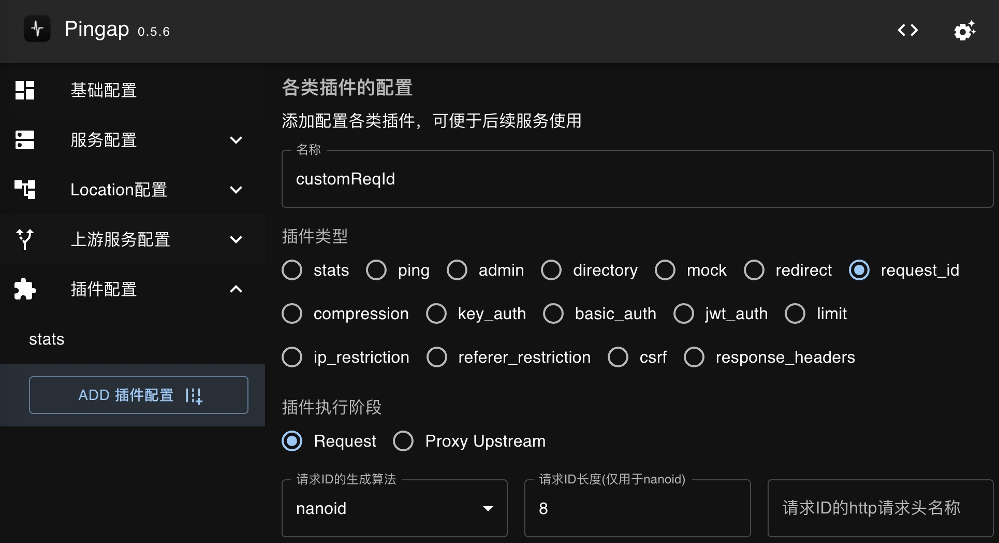
</p>

## Compression

压缩中间件，处理从上游返回的相关数据压缩，由于`pingora`对于压缩的匹配顺序为`gzip --> br --> zstd`，官方暂未支持调整优先级，而对于现代浏览器，基本都支持`gzip`，大部分支持`br`，少部分支持`zstd`，为了使用更好的压缩方式，此插件会调整请求的`Accept-Encoding`，让压缩的顺序调整为`zstd --> br --> gzip`。配置如下：

```toml
[plugins.commonCompression]
br_level = 6
category = "compression"
gzip_level = 6
zstd_level = 5
```

需要注意三种压缩算法的压缩级别不一样，按需选择即可，也可使用自带的`pingap:compression`，它的压缩级别配置为`gzip_level = 6`, `br_level = 6`, `zstd_level = 3`。

界面配置如图所示，按需分别配置对应的压缩级别即可，若不想启用该压缩算法则配置为0：

<p align="center">
    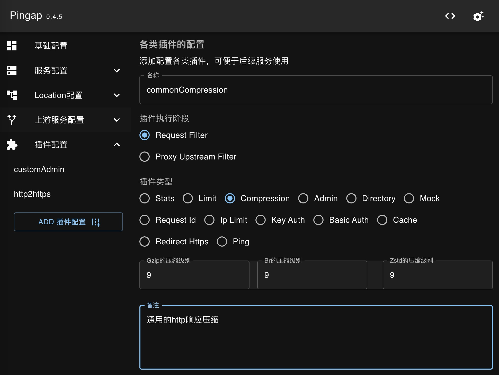
</p>

## KeyAuth

KeyAuth用于提供简单的认证方式，支持配置从query或header中获取值，可配置多个校验值，方便多系统接入。

从query中的app字段中获取校验：

```toml
[plugins.appAuth]
category = "key_auth"
hide_credentials = true
keys = [
    "KOXQaw",
    "GKvXY2",
]
query = "app"
```

从header中的X-App字段中获取校验：

```toml
[plugins.appAuth]
category = "key_auth"
hide_credentials = true
header = "X-App"
keys = [
    "KOXQaw",
    "GKvXY2",
]
```

界面配置如图所示，配置key的名称，再配置符合的值即可：

<p align="center">
    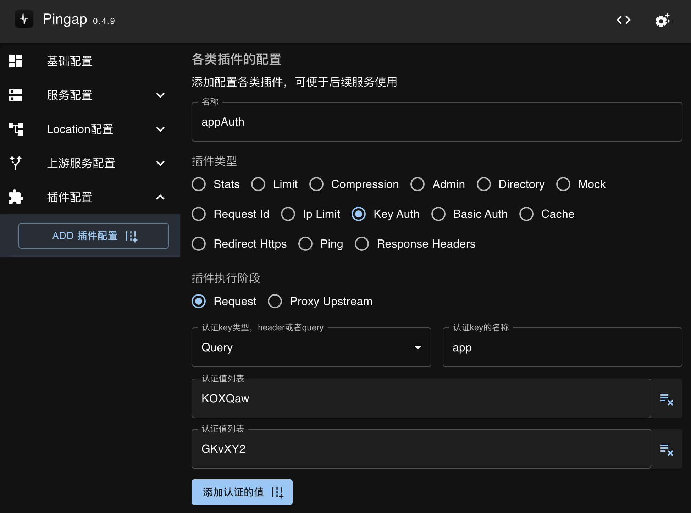
</p>

## BasicAuth

BasicAuth鉴权，配置时需要使用保存`base64(user:pass)`的值，若有多个则配置多个即可。

```toml
[plugins.testBasicAuth]
authorizations = [
    "YWRtaW46dGVzdA==",
    "YWRtaW46MTIzMTIz",
]
category = "basic_auth"
hide_credentials = true
```

界面配置如图所示，配置basic auth的值，需要注意配置已做base64处理后的值即可：

<p align="center">
    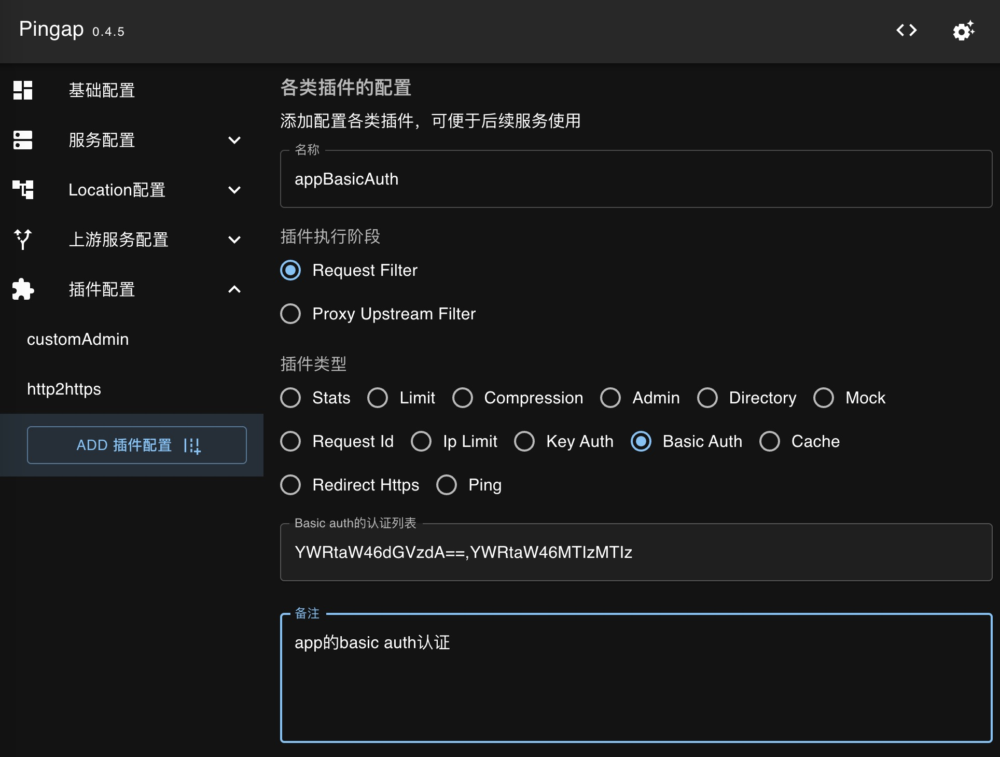
</p>

## Limit

可基于cookie、请求头或query参数来限制并发访问，支持`inflight`(并发)与`rate`(访问频率)两种限制类型，若配置的字段获取到的值为空，则不限制，支持`inflight`与`rate`两种限制类型。

根据cookie的`bigtree`限制并发数为`10`:

```toml
[plugins.cookieBigTreeLimit]
category = "limit"
key = "bigtree"
max = 10
tag = "cookie"
type = "inflight"
```

根据请求头的`X-App`参数限制并发数`10`:

```toml
[plugins.headerAppLimit]
category = "limit"
key = "X-App"
max = 10
tag = "header"
type = "inflight"
```

根据query中的`app`参数限制1秒钟仅能访问`10`次:

```toml
[plugins.queryAppLimit]
category = "limit"
interval = "1s""
key = "app"
max = 10
tag = "query"
type = "rate"
```

根据ip限制1分钟最多访问`10`次(ip获取的顺序为X-Forwarded-For --> X-Real-Ip --> Remote Addr):

```toml
[plugins.ipLimit]
category = "limit"
interval = "1m"
max = 10
tag = "ip"
type = "rate"
```

界面配置如图所示，主要是配置限制条件以及对应的最大并发访问量：

<p align="center">
    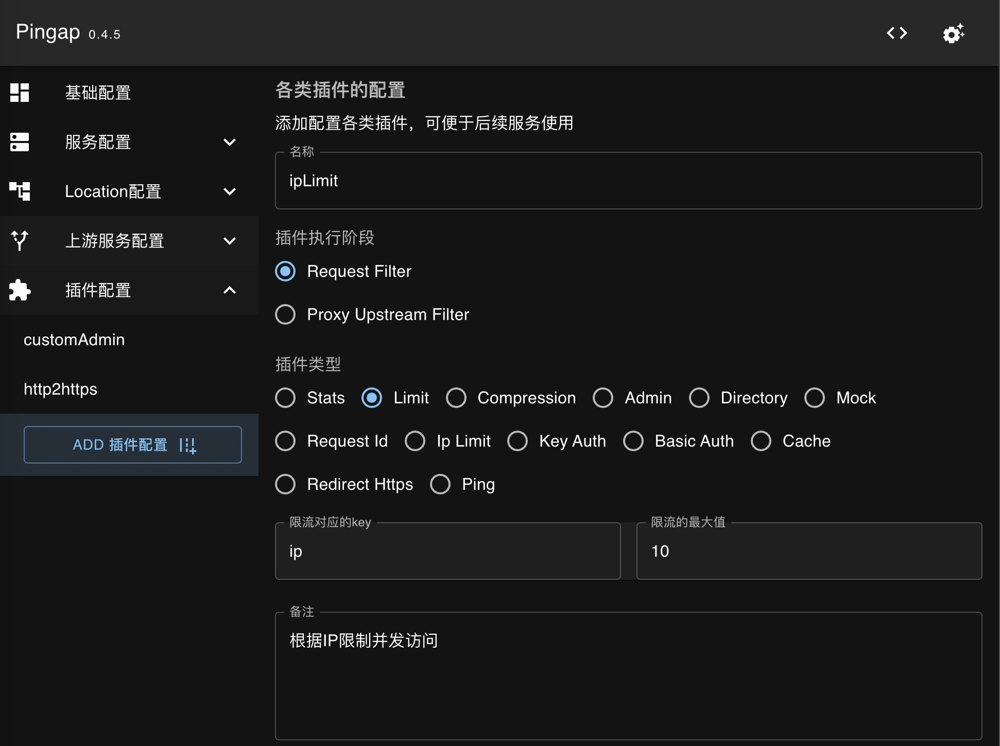
</p>

## IpRestriction

Ip限制分为两种模式，允许或禁止，ip可支持配置为单ip或ip组，配置如下：

```toml
[plugins.ipDeny]
category = "ip_restriction"
ip_list = [
    "192.168.1.1",
    "1.1.1.0/24",
]
message = "禁止该IP访问"
type = "deny"
```

界面配置如图所示，配置IP列表后，填写是允许还是禁止即可：

<p align="center">
    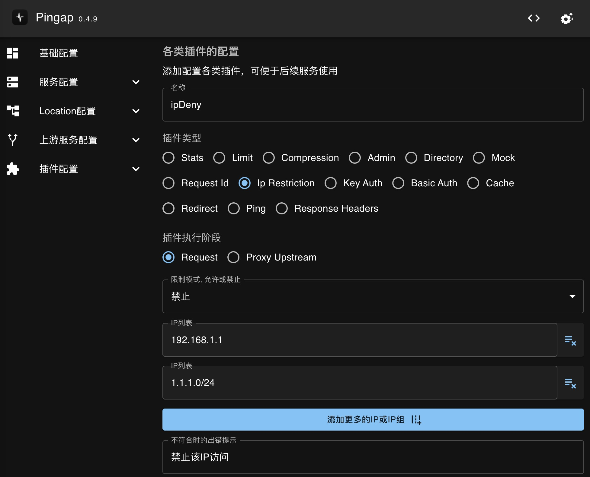
</p>

## RefererRestriction

Referer限制分为两种模式，允许或禁止，配置时可使用*前缀匹配，配置如下：

```toml
[plugins.referer]
category = "referer_restriction"
message = ""
referer_list = ["*.github.com"]
type = "allow"
```

界面配置如图所示，配置Referer列表后，填写是允许还是禁止即可：


<p align="center">
    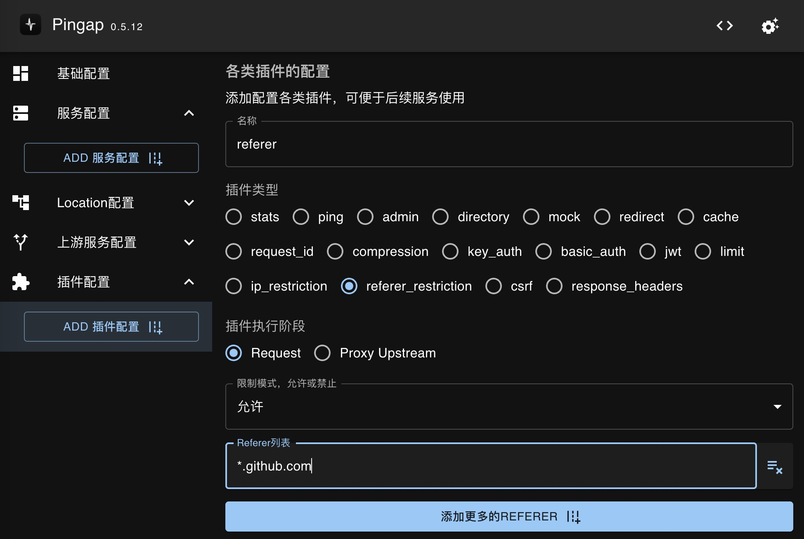
</p>


## Cache

Http缓存，仅支持内存式缓存，暂不建议使用。


## ResponseHeaders

响应头的插件主要是设置、添加以及删除请求头。若响应头的值设置为`$hostname`表示获取机器的hostname，若以`$`开头的则表示从环境变量中获取对应的值。

```toml
[plugins.commonResponseHeaders]
add_headers = ["X-Server:pingap"]
category = "response_headers"
remove_headers = ["X-User"]
set_headers = ["X-Response-Id:123"]
step = "response"
```

界面配置如图所示，按需要配置要设置、添加或删除的响应头，若不需要则不设置即可：

<p align="center">
    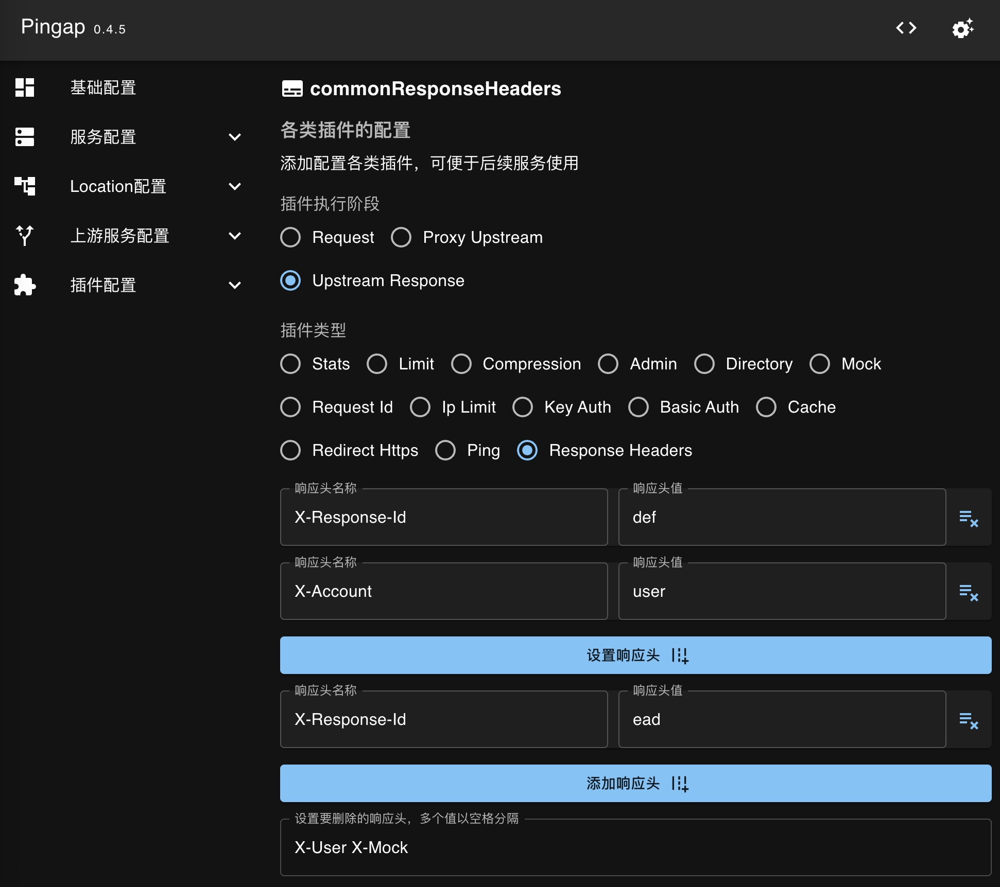
</p>
