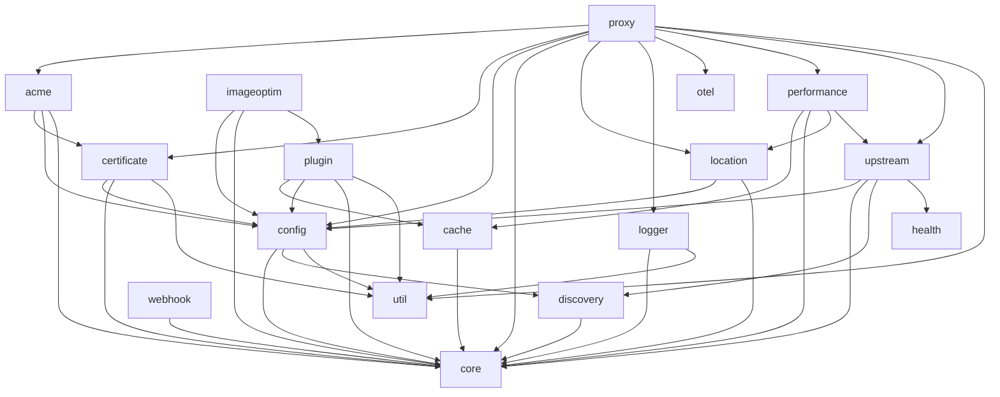

# Pingap

<p class="hero-logo"></p>

基于 [Cloudflare Pingora](https://github.com/cloudflare/pingora) 的高性能反向代理，支持配置热更新、Web 管理界面与 20+ 插件（认证、限流、缓存、可观测性等）。

| | |
| --- | --- |
| **从这里开始** | [快速开始](#快速开始docker) · [插件](plugins/) · [组件](crates/) · [架构](guide/modules.md) · [示例](guide/examples.md) |
| **链接** | [English](/en/#/ ':ignore') · [GitHub](https://github.com/vicanso/pingap) · [Releases](https://github.com/vicanso/pingap/releases) |

## 核心特性

- **高性能** — Rust + Pingora；HTTP/1.1、HTTP/2、gRPC-Web
- **热更新** — 零停机配置变更（`--autoreload` / `--autorestart`）
- **Web 管理** — 在 UI 中管理 server、location、upstream 与插件
- **插件** — 认证、访问控制、限流、缓存、CORS、静态文件等
- **服务发现** — 静态列表、DNS、Docker 标签、透明代理
- **ACME** — Let's Encrypt HTTP-01 与 DNS-01（含通配符）
- **可观测性** — Prometheus、OpenTelemetry、访问日志、Pyroscope、Sentry

## 快速开始（Docker）

```yaml
# docker-compose.yml
services:
  pingap:
    image: vicanso/pingap:latest
    container_name: pingap-instance
    restart: always
    ports:
      - "80:80"
      - "443:443"
    volumes:
      - ./pingap_data:/opt/pingap
    environment:
      - PINGAP_CONF=/opt/pingap/conf
      - PINGAP_ADMIN_ADDR=0.0.0.0:80/pingap
      - PINGAP_ADMIN_USER=pingap
      - PINGAP_ADMIN_PASSWORD=<YourSecurePassword>
    command: ["pingap", "--autoreload"]
```

```bash
mkdir pingap_data
docker compose up -d
# 管理后台: http://localhost/pingap
```

### 安装二进制

```bash
curl -sSL https://raw.githubusercontent.com/vicanso/pingap/main/install.sh | sh
# 完整特性构建: PINGAP_FULL=1 sh
```

### 一条命令启动 HTTPS 代理

```bash
pingap --domain=pingap.io --upstream=192.168.1.1:3000
```

不带 `--cert` 时，Pingap 通过 HTTP-01 向 Let's Encrypt 申请证书，因此 `pingap.io` 必须解析到本机，且 80 端口可从公网访问。证书保存在 `~/.pingap/acme/<domains>.toml`，重启会复用——申请有速率限制，请勿随意删除。`--upstream` 为逗号分隔的后端列表，`--domain` 为逗号分隔的主机名（省略则用明文 HTTP 服务所有主机）。

## 架构（crates）



完整模块关系见 [架构](guide/modules.md)。

## 插件分类

| 分类 | 示例 |
| --- | --- |
| 认证 | `basic_auth`, `key_auth`, `jwt`, `combined_auth`, `forward_auth`, `csrf` |
| 访问控制 | `ip_restriction`, `referer_restriction`, `ua_restriction`, `geo_restriction` |
| 流量控制 | `limit`, `traffic_splitting`, `cache` |
| 内容 | `compression`, `directory`, `sub_filter`, `cors`, `redirect`, `image_optim` |
| 运维 | `ping`, `mock`, `request_id`, `stats`, `admin` |

完整索引与配置说明：**[插件](plugins/)**。

## 配置示例

```toml
[servers.main]
addr = "0.0.0.0:6188"
locations = ["api"]

[locations.api]
upstream = "api"
path = "/api"
plugins = ["compression", "jwtAuth"]

[upstreams.api]
addrs = ["10.0.0.1:8080", "10.0.0.2:8080"]
discovery = "dns"
update_frequency = "30s"

[plugins.jwtAuth]
category = "jwt"
header = "Authorization"
secret = "change-me"
algorithm = "HS256"

[plugins.compression]
category = "compression"
gzip_level = 6
br_level = 6
zstd_level = 3
```

支持 **TOML**、**HCL** 与 **KDL**。详见 [pingap-config](crates/config.md)。

## 请求生命周期

插件在代理流水线中的**某一个**步骤运行：

| 步骤 | 时机 | 典型用途 |
| --- | --- | --- |
| `early_request` | 读完请求头、路由之前 | Accept-Encoding、压缩协商 |
| `request` | 匹配到 location 之后 | 认证、限流、缓存、静态文件 |
| `proxy_upstream` | 选择后端之前 | 不应在缓存命中时执行的检查 |
| `upstream_response` | 上游响应头到达时 | 头改写、响应体变换 |
| `response` | 发往客户端之前 | 响应头、sub_filter |

详见 [pingap-proxy](crates/proxy.md) 与 [插件生命周期](plugins/#生命周期步骤)。

## 动态配置

- **热更新（`--autoreload`）**：多数变更（upstream、location、插件等）约 10 秒内就地生效，无需重启。容器环境推荐。
- **平滑重启（`-a` / `--autorestart`）**：监听端口等基础变更时做零停机优雅重启。

## 许可证

Apache-2.0。见 [LICENSE](https://github.com/vicanso/pingap/blob/main/LICENSE)。
