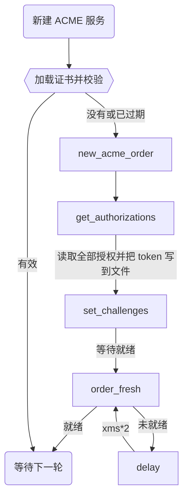
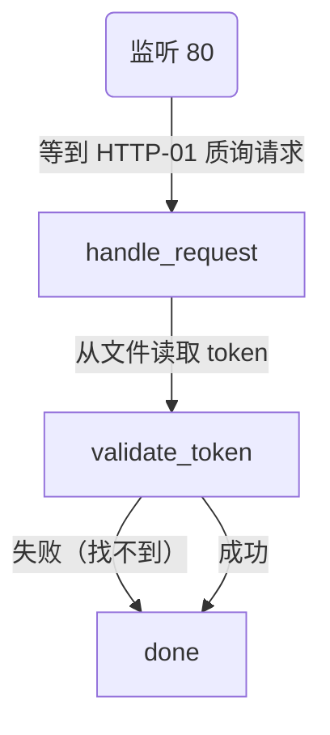

# ACME

### Acme 服务

```mermaid
graph TD;
  start("新建 ACME 服务") --> validate_certificate{{加载证书并校验}};
  validate_certificate -- 没有或已过期 --> new_acme_order;

  new_acme_order --> get_authorizations;

  get_authorizations -- 读取全部授权并把 token 写到文件 --> set_challenges;

  set_challenges -- 等待就绪 --> order_fresh;

  order_fresh -- 就绪 --> done;
  order_fresh -- 未就绪 --> delay;

  delay -- xms*2 --> order_fresh

  validate_certificate -- 有效 --> done("等待下一轮");
```

### Http 01 Challenge

```mermaid
graph TD;
  start("监听 80") -- 等到 HTTP-01 质询请求 --> handle_request;

  handle_request -- 从文件读取 token --> validate_token;

  validate_token -- 失败（找不到） --> done;

  validate_token -- 成功 --> done;
```
