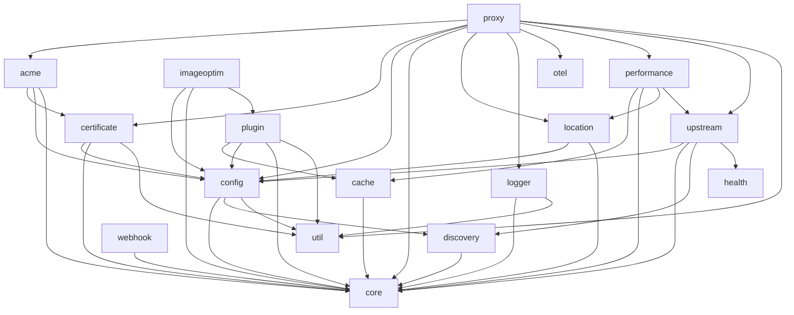

# Pingap 模块

- `acme`：基于 ACME 协议自动申请与续期 SSL/TLS 证书
- `cache`：缓存机制，提升性能并降低后端负载
- `certificate`：SSL/TLS 证书管理、存储与校验
- `config`：配置管理与解析
- `core`：核心能力与跨模块共享组件
- `discovery`：服务发现，用于动态感知后端
- `health`：后端健康检查与状态监控
- `location`：URL 路由与基于 location 的请求处理
- `logger`：日志能力与日志管理
- `otel`：OpenTelemetry 集成，用于分布式追踪与指标
- `performance`：性能指标
- `proxy`：Pingap 代理服务
- `plugin`：插件系统，用于扩展功能
- `pyroscope`：集成 Pyroscope 做持续剖析
- `sentry`：通过 Sentry 做错误追踪与监控
- `upstream`：后端连接与负载均衡
- `util`：共享工具函数与辅助方法
- `webhook`：多种 webhook 协议，向外部服务发送通知
- `imageoptim`：图片优化，支持 png、jpeg、webp、avif

